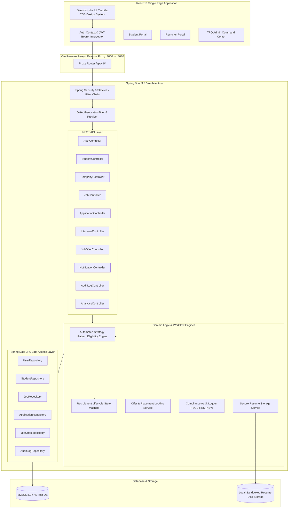

# Smart Placement Management System (SPMS)

[](https://spring.io/projects/spring-boot)
[](https://openjdk.org/)
[](https://react.dev/)
[](https://vitejs.dev/)
[](LICENSE)
[](target/surefire-reports)

An enterprise-grade, full-stack campus recruitment platform engineered for universities, academic institutions, and corporate talent acquisition panels. Built with **Spring Boot 3.3.5**, **Spring Security 6**, **Java 21 LTS**, **Hibernate ORM**, and a responsive **React 18 SPA** with modern dark-glassmorphism aesthetics.

---

## 🏛️ System Architecture



---

## 🌟 Key Capabilities & Architectural Innovations

### 1. Strategy Pattern Rule-Based Eligibility Engine
Rather than rigid hard-coded qualifications, SPMS uses the **Gang of Four (GoF) Strategy Pattern** to decouple qualification logic into modular evaluator beans adhering to the Open/Closed Principle:
- `CgpaEvaluator`: Minimum cumulative grade point average threshold.
- `BacklogEvaluator`: Maximum permitted active backlogs and historical backlogs.
- `BranchEvaluator`: Multi-branch qualification matching (CSE, IT, ECE, EEE, etc.).
- `GraduationYearEvaluator`: Graduation batch cohort filtering.
- `SecondaryEducationEvaluator`: Minimum 10th & 12th board marks (with lateral diploma substitution support).
- `SkillSetEvaluator`: Mandatory candidate technical skills requirement.
- `GapYearEvaluator`: Maximum allowable academic gap years.
- **Granular Rejection Telemetry**: Candidates receive exact reasons why they are disqualified before applying.

### 2. Recruitment Lifecycle State Machine
Guarantees database-level idempotency and validates transitions across the hiring funnel:
$$\text{APPLIED} \longrightarrow \text{SHORTLISTED} \longrightarrow \text{INTERVIEW\_SCHEDULED} \longrightarrow \text{OFFERED} \longrightarrow \text{ACCEPTED} \text{ / } \text{DECLINED}$$
- Enforces terminal state protections (`OFFER_ACCEPTED`, `OFFER_DECLINED`, `REJECTED`, `WITHDRAWN`).
- Immutable resume snapshotting at application time (`resumeSnapshotUrl`).
- One-offer acceptance placement locking (`isPlaced = true`) to enforce university placement policies.

### 3. Regulatory Audit Trail & Compliance Exports
- **Independent Transaction Auditing**: Audit events are recorded via `Propagation.REQUIRES_NEW`, guaranteeing audit records persist even if business transactions roll back.
- **RFC 4180 CSV Streaming**: TPO officers can export complete institutional placement master records (`campus_placements_master_report.csv`) with zero memory leakage.

---

## 🔑 Pre-Configured Demo Accounts

The application automatically seeds a full demonstration dataset upon first startup when connected to MySQL:

| Role | Email | Password | Access & Features |
| :--- | :--- | :--- | :--- |
| **TPO Administrator** | `admin@smartplacement.com` | `Admin@123` | Institutional dashboard, corporate partner verification, audit trail, CSV export |
| **Lead Recruiter (Google)** | `recruiter@google.com` | `Recruiter@123` | Post placement drives, review candidate pipeline, schedule rounds, extend offers |
| **Active Student (Alex)** | `student@smartplacement.com` | `Student@123` | Profile/Resume management, live eligibility evaluation, job applications, interview calendar |
| **Placed Student (Priya)** | `priya.sharma@campus.edu` | `Student@123` | Placed student record with accepted offer |

---

## 🚀 Quick Start Guide

### Prerequisites
- **Java 21 LTS** (`java -version`)
- **Node.js 18+** & **npm** (`node -v`, `npm -v`)
- **MySQL 8.0** running on `localhost:3306` (or Docker)

### 1. Database Setup
Create the MySQL database:
```sql
CREATE DATABASE IF NOT EXISTS smart_placement_db;
```
Configure your credentials in `src/main/resources/application.yml` or pass via environment variables (`DB_USERNAME`, `DB_PASSWORD`).

### 2. Start the Backend Server (Spring Boot)
From the project root:
```bash
# Windows
.\mvnw.cmd spring-boot:run

# Linux / macOS
./mvnw spring-boot:run
```
The server will start on **`http://localhost:8080`**.
- OpenAPI / Swagger UI: [http://localhost:8080/swagger-ui.html](http://localhost:8080/swagger-ui.html)
- API Docs JSON: [http://localhost:8080/v3/api-docs](http://localhost:8080/v3/api-docs)

### 3. Start the Frontend Application (React SPA)
From the `frontend/` directory:
```bash
cd frontend

# Install dependencies (if not already installed)
npm install

# Start Vite development server
npm run dev
```
The frontend will launch on **`http://localhost:3000`** with automatic `/api` proxying to `http://localhost:8080`.

---

## 🧪 Running the Automated Test Suite

SPMS includes a comprehensive unit and integration test suite with **87 passing tests and 0 failures**:
```bash
# Run all unit and integration tests
.\mvnw.cmd test

# Run a specific test class
.\mvnw.cmd test -Dtest=JobOfferControllerIntegrationTest

# Compile production frontend bundle
cd frontend && npm run build
```

---

## 📋 Complete REST API Reference

| Endpoint | Method | Allowed Roles | Description |
| :--- | :---: | :---: | :--- |
| `/api/v1/auth/login` | `POST` | `PUBLIC` | Authenticate user & issue JWT bearer token |
| `/api/v1/auth/student/register` | `POST` | `PUBLIC` | Register new student account & profile |
| `/api/v1/auth/recruiter/register` | `POST` | `PUBLIC` | Register employer recruiter account |
| `/api/v1/auth/me` | `GET` | `AUTHENTICATED` | Retrieve current authenticated session metadata |
| `/api/v1/students/me` | `GET / PUT` | `ROLE_STUDENT` | View or update personal student details |
| `/api/v1/students/me/academic` | `PUT` | `ROLE_STUDENT` | Update academic marks, CGPA, backlogs |
| `/api/v1/students/me/resume` | `POST / GET` | `ROLE_STUDENT` | Secure PDF resume upload and download |
| `/api/v1/students/me/skills` | `POST / DELETE` | `ROLE_STUDENT` | Add or delete technical skills |
| `/api/v1/companies` | `GET / POST` | `AUTHENTICATED` | List or register corporate partner profiles |
| `/api/v1/companies/{id}/verify` | `PUT` | `ROLE_TPO_ADMIN` | Approve and verify corporate partner |
| `/api/v1/jobs` | `GET / POST` | `AUTHENTICATED` | Browse jobs or publish placement drive |
| `/api/v1/jobs/{id}/my-eligibility` | `GET` | `ROLE_STUDENT` | Evaluate candidate eligibility against 7 rules |
| `/api/v1/jobs/{id}/eligible-candidates`| `GET` | `ROLE_RECRUITER, ROLE_TPO_ADMIN` | Preview campus-wide qualified talent pool |
| `/api/v1/applications/jobs/{jobId}/apply` | `POST` | `ROLE_STUDENT` | Submit drive application with automated screening |
| `/api/v1/applications/my` | `GET` | `ROLE_STUDENT` | Candidate personal application pipeline |
| `/api/v1/applications/jobs/{jobId}` | `GET` | `ROLE_RECRUITER, ROLE_TPO_ADMIN` | Recruiter candidate pipeline review |
| `/api/v1/applications/{id}/status` | `PUT` | `ROLE_RECRUITER, ROLE_TPO_ADMIN` | Transition candidate stage in state machine |
| `/api/v1/interviews/schedule` | `POST` | `ROLE_RECRUITER, ROLE_TPO_ADMIN` | Schedule interview round and notify candidate |
| `/api/v1/interviews/{id}/result` | `PUT` | `ROLE_RECRUITER, ROLE_TPO_ADMIN` | Record evaluation verdict (PASSED/FAILED) |
| `/api/v1/offers/issue` | `POST` | `ROLE_RECRUITER, ROLE_TPO_ADMIN` | Extend formal job placement offer |
| `/api/v1/offers/{id}/respond` | `PUT` | `ROLE_STUDENT` | Accept or decline placement offer |
| `/api/v1/analytics/student-dashboard` | `GET` | `ROLE_STUDENT` | Student KPI dashboard telemetry |
| `/api/v1/analytics/recruiter-dashboard`| `GET` | `ROLE_RECRUITER` | Recruiter recruitment funnel metrics |
| `/api/v1/analytics/tpo-dashboard` | `GET` | `ROLE_TPO_ADMIN` | Executive university placement analytics |
| `/api/v1/analytics/export/placements` | `GET` | `ROLE_TPO_ADMIN` | Stream RFC 4180 CSV placement master sheet |
| `/api/v1/audit-logs` | `GET` | `ROLE_TPO_ADMIN` | Search immutable administrative audit trail |

---

## 📦 Project Structure

```text
smart-placement-system/
├── frontend/                          # React 18 SPA (Vite)
│   ├── public/                        # Static icons & favicons
│   ├── src/
│   │   ├── components/                # Reusable UI widgets
│   │   │   ├── Navbar.jsx             # Glassmorphic top navigation & user menu
│   │   │   ├── NotificationDropdown.jsx # Real-time alerts drawer
│   │   │   ├── StatCard.jsx           # KPI metrics card component
│   │   │   └── EligibilityModal.jsx   # Interactive rule-by-rule evaluation modal
│   │   ├── context/                   # React context providers
│   │   │   └── AuthContext.jsx        # JWT session state & role helpers
│   │   ├── pages/                     # Full portal views
│   │   │   ├── AuthPage.jsx           # Sign In / Register with 1-Click Demo Fill
│   │   │   ├── StudentPortal.jsx      # Student career dashboard & offer acceptance
│   │   │   ├── RecruiterPortal.jsx    # Recruiter drive management & interview scheduler
│   │   │   └── TpoAdminPortal.jsx     # Institutional analytics, verification, CSV export
│   │   ├── services/
│   │   │   └── api.js                 # Centralized fetch API client with JWT injection
│   │   ├── App.jsx                    # Role-based router
│   │   └── index.css                  # Custom design tokens & glassmorphic utilities
│   └── vite.config.js                 # Vite proxy & build configuration
├── src/main/java/com/smartplacement/  # Spring Boot 3.3.5 Backend
│   ├── config/                        # Security, Swagger & Data Seeder
│   ├── controller/                    # REST API Controllers
│   ├── dto/                           # Data Transfer Objects
│   ├── engine/eligibility/            # Strategy Pattern Eligibility Rules
│   │   ├── evaluator/                 # Pluggable Criteria Evaluator beans
│   │   └── EligibilityEngine.java     # Multi-rule master coordinator
│   ├── entity/                        # JPA Entities & Enums
│   ├── exception/                     # Global Error Envelope & Exception Handlers
│   ├── repository/                    # Spring Data JPA Repositories
│   ├── security/                      # JWT Token Provider & Filter
│   └── service/                       # Business Logic & Workflows
├── src/test/java/                     # Unit & Integration Test Suites
│   ├── controller/                    # End-to-end MockMvc Integration Tests
│   ├── engine/                        # Eligibility Engine Unit Tests
│   ├── security/                      # JWT Provider Unit Tests
│   └── service/                       # File Storage Unit Tests
├── AGENT_LOG.md                       # Comprehensive phase-by-phase execution log
├── pom.xml                            # Maven dependencies & build plugins
└── README.md                          # Master documentation & architecture guide
```

---

## 🔒 Security Best Practices
- **Stateless Session Management**: Zero server-side session state; JWT bearer token validated on every request.
- **Role-Based Method Security**: `@PreAuthorize("hasRole(...)")` enforces strict boundary controls across endpoints.
- **Isolated Auditing**: System logs are emitted in independent transactions to protect audit records from business rollbacks.
- **Sandboxed Resume Storage**: Uploaded PDF files are validated for MIME type, sanitised, and kept outside the public web root.

---

## 📄 License
This project is licensed under the [MIT License](LICENSE).
