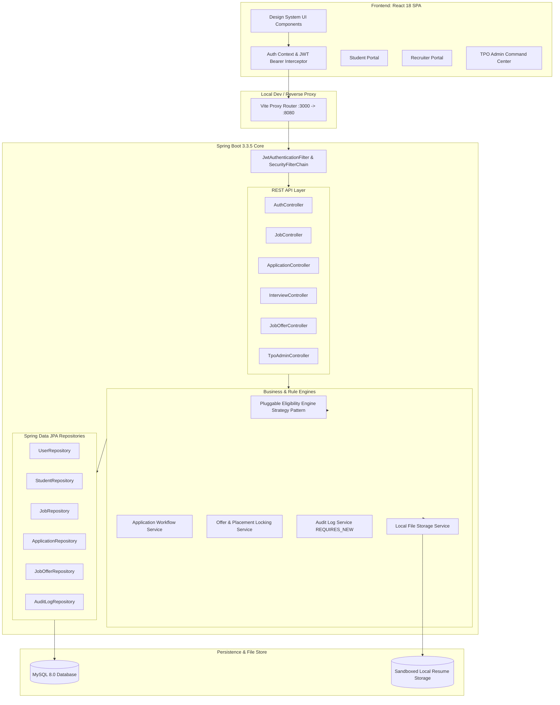
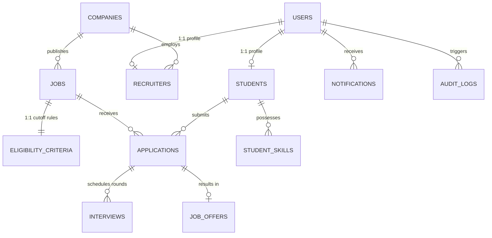

# 🎓 Smart Placement Management System (SPMS)

[](https://spring.io/projects/spring-boot)
[](https://openjdk.org/)
[](https://react.dev/)
[](https://vitejs.dev/)
[](https://www.mysql.com/)
[](target/surefire-reports)
[](LICENSE)

> **Automating university campus placements end-to-end with pluggable eligibility screening, role-based workflows, and statutory compliance intelligence.**

---

## 📌 Problem Statement

Every recruitment season, university Training and Placement Offices (TPO) struggle to manage hundreds of corporate drives and thousands of graduating candidates using fragmented spreadsheets and manual email threads. This leads to:
1. **Screening Inefficiencies**: Ineligible candidates slip through complex criteria (CGPA cutoffs, active backlogs, secondary education marks, gap years, and branch restrictions).
2. **Hiring Funnel Bottlenecks**: Recruiters lack unified workflows to shortlist applicants, schedule interview rounds, and extend job offers with strict university placement locking.
3. **Regulatory Reporting Burdens**: Assembling institutional placement statistics for accreditation bodies (NAAC, NIRF) takes weeks of manual data compilation.

**Smart Placement Management System (SPMS)** eliminates these pain points through a single, secure, role-based platform with a real-time Strategy-pattern eligibility engine and 1-click statutory compliance export.

---

## ✨ Features by Role

### 👨‍🎓 Student Portal (`ROLE_STUDENT`)
- **Academic Profile Management**: Maintain verified CGPA, 10th/12th percentages, active backlogs, graduation year, and technical skills.
- **Sandboxed Resume Vault**: Upload PDF resumes with strict MIME validation, file size limits, and path-traversal protection.
- **Real-Time Eligibility Telemetry**: Browse campus drives and instantly see eligibility status with itemized pass/fail reasons before applying.
- **Application Funnel Tracking**: Monitor progress across hiring stages (`APPLIED` → `SHORTLISTED` → `INTERVIEW` → `OFFERED`).
- **Interactive Offer Management**: Review official offers with salary packages (CTC), valid deadlines, and one-offer institutional locking upon acceptance.

### 🏢 Recruiter Portal (`ROLE_RECRUITER`)
- **Drive Lifecycle Management**: Publish recruitment drives with CTC, job description, hiring deadlines, and granular eligibility rules.
- **Targeted Candidate Discovery**: Preview qualified candidate pools before publishing drives to adjust cutoff criteria dynamically.
- **Candidate Pipeline Review**: Filter applicants by status, download sandboxed candidate resumes, and transition candidates through hiring stages.
- **Interview Scheduling**: Schedule Technical, HR, and Assessment rounds with meeting links, timestamps, and interviewer notes.
- **Offer Issuance**: Issue formal job placement offers with binding deadlines and compensation figures.

### 🏛️ TPO Admin Command Center (`ROLE_TPO_ADMIN`)
- **Executive Institutional Dashboard**: Track overall placement rates, salary tier distributions (Super Dream, Dream, Regular), and department-wise progress bars.
- **Corporate Partner Verification**: Verify employer profiles to ensure campus safety and legitimate recruiter onboarding.
- **Student Academic Directory**: Search and audit student academic records and application history across all academic branches.
- **Statutory Reporting Engine**: Generate 1-click RFC 4180-compliant CSV exports formatted for NAAC & NIRF institutional audits.
- **Security Audit Trail**: Inspect tamper-evident, independent transaction audit logs (`REQUIRES_NEW`) recording user actions, timestamps, and IP addresses.

---

## 🛠️ Technology Stack

| Layer | Technologies |
|---|---|
| **Backend Framework** | Spring Boot 3.3.5, Java 21 LTS |
| **Security & Auth** | Spring Security 6, Stateless JWT (JJWT 0.12.6), BCrypt Hashing, RBAC |
| **Data Persistence** | Spring Data JPA, Hibernate ORM 6.5, HikariCP Connection Pooling |
| **Databases** | MySQL 8.0 (Production), H2 In-Memory (Hermetic Integration Test Suite) |
| **API Documentation** | Springdoc OpenAPI 3.0, Swagger UI 2.6.0 |
| **Frontend Framework** | React 18, Vite 8, React Router v6 |
| **Styling & UI System** | Custom Vanilla CSS Design System (Linear/Raycast aesthetic, dark glassmorphism, responsive) |
| **Build & Testing** | Maven Wrapper (`mvnw`), JUnit 5, MockMvc, Vite Client Build |

---

## 🏛️ System Architecture



---

## 🗄️ Relational Entity-Relationship Diagram



---

## 🧠 Pluggable Eligibility Engine

The SPMS eligibility evaluation subsystem is engineered around the **GoF Strategy Pattern**, decoupling recruitment business rules from core application services:

1. **Strategy Interface**: [`EligibilityEvaluator`](file:///c:/Users/HP%20R5/OneDrive/Desktop/smart-placement-system/smart-placement-system/src/main/java/com/smartplacement/engine/eligibility/EligibilityEvaluator.java) defines a single evaluation contract returning `Optional<String>` (failure reason or empty if eligible).
2. **7 Pluggable Evaluators**:
   - `MinCgpaEvaluator`: Checks candidate cumulative grade point average against drive minimum.
   - `MaxBacklogsEvaluator`: Verifies active academic backlogs do not exceed company threshold.
   - `EligibleBranchesEvaluator`: Validates candidate engineering branch against allowed disciplines.
   - `GraduationYearEvaluator`: Enforces graduating batch restrictions.
   - `MinTenthMarksEvaluator`: Secondary education cutoff screening.
   - `MinTwelfthMarksEvaluator`: Higher secondary / diploma marks cutoff screening.
   - `RequiredSkillsEvaluator`: Matches candidate skills profile against mandatory drive competencies.
3. **Automatic Spring Bean Discovery**: `EligibilityEngine` receives `List<EligibilityEvaluator>` automatically collected by Spring's IoC container. Adding a new rule requires zero modifications to existing services (**Open/Closed Principle**).

---

## 🔑 Pre-Configured Demo Accounts

The system automatically initializes demonstration credentials upon first startup:

| Role | Email | Password | Access & Features |
| :--- | :--- | :--- | :--- |
| **TPO Administrator** | `admin@smartplacement.com` | `Admin@123` | Full administrative analytics, partner verification, audit logs, NAAC CSV export |
| **Lead Recruiter** | `recruiter@google.com` | `Recruiter@123` | Post drives, review candidate applications, schedule interview rounds, extend offers |
| **Active Student** | `student@smartplacement.com` | `Student@123` | Profile/resume management, drive discovery, automated eligibility evaluation, job applications |
| **Placed Student** | `priya.sharma@campus.edu` | `Student@123` | Placed student account with accepted offer and placement locking |

*(Note: Default demo passwords are for local development and testing only).*

---

## 💻 Windows Setup Guide

### Prerequisites
- **Java 21 LTS** or newer (Verify: `java -version`)
- **Node.js 18+** & **npm** (Verify: `node -v` and `npm -v`)
- **MySQL Server 8.0** running on `localhost:3306`

### 1. MySQL Database Setup
Open MySQL command line or MySQL Workbench:
```sql
CREATE DATABASE IF NOT EXISTS smart_placement_db;
```

### 2. Configure Environment Variables
Copy the template file to `.env`:
```powershell
Copy-Item .env.example .env
```
Ensure your MySQL username and password match your local installation.

### 3. Start the Backend Server (Spring Boot)
From the project root directory:
```powershell
.\mvnw.cmd spring-boot:run
```
The server will start at **`http://localhost:8080`**.
- OpenAPI Spec: `http://localhost:8080/v3/api-docs`
- Swagger UI Documentation: `http://localhost:8080/swagger-ui.html`

### 4. Start the Frontend Application (React SPA)
Open a second PowerShell terminal:
```powershell
cd frontend
npm install
npm run dev
```
The application will launch at **`http://localhost:3000`** with automatic proxying to the backend.

---

## ⚙️ Environment Variables Table

| Variable | Description | Default / Example Value |
|---|---|---|
| `DB_HOST` | MySQL database host address | `localhost` |
| `DB_PORT` | MySQL database port | `3306` |
| `DB_NAME` | Database schema name | `smart_placement_db` |
| `DB_USERNAME` | MySQL database username | `root` |
| `DB_PASSWORD` | MySQL user password | `your_mysql_password_here` |
| `JWT_SECRET` | 256-bit HMAC signing key (64 hex characters) | `your_dev_jwt_secret_key_placeholder_min_64_hex_chars_0000000000000000` |
| `JWT_EXPIRATION_MS` | JWT validity lifetime in milliseconds | `86400000` (24 Hours) |
| `SERVER_PORT` | Spring Boot HTTP server port | `8080` |
| `UPLOAD_DIR` | Local disk folder for resume storage | `./uploads` |
| `VITE_API_BASE_URL` | Base API URL used by the frontend | `http://localhost:8080` |

---

## 📡 REST API Overview

Comprehensive Postman and OpenAPI collections are available in [`docs/postman/`](file:///c:/Users/HP%20R5/OneDrive/Desktop/smart-placement-system/smart-placement-system/docs/postman/):
- **OpenAPI 3.0 JSON Spec**: [`docs/postman/openapi.json`](file:///c:/Users/HP%20R5/OneDrive/Desktop/smart-placement-system/smart-placement-system/docs/postman/openapi.json)
- **Postman Collection v2.1.0**: [`docs/postman/SmartPlacement_Collection.postman_collection.json`](file:///c:/Users/HP%20R5/OneDrive/Desktop/smart-placement-system/smart-placement-system/docs/postman/SmartPlacement_Collection.postman_collection.json)

| Endpoint | Verb | Roles | Purpose |
|---|:---:|---|---|
| `/api/v1/auth/login` | `POST` | Public | Authenticate user & issue signed JWT |
| `/api/v1/auth/student/register` | `POST` | Public | Register new student profile |
| `/api/v1/auth/recruiter/register` | `POST` | Public | Register employer recruiter |
| `/api/v1/auth/me` | `GET` | Authenticated | Retrieve authenticated user principal |
| `/api/v1/students/me` | `GET / PUT` | `ROLE_STUDENT` | View or update student profile |
| `/api/v1/students/me/resume` | `POST / GET` | `ROLE_STUDENT` | Upload & download sandboxed PDF resume |
| `/api/v1/jobs` | `GET / POST` | Authenticated | Browse drives or publish new drive |
| `/api/v1/jobs/{id}/my-eligibility` | `GET` | `ROLE_STUDENT` | Run 7-rule eligibility check |
| `/api/v1/applications/jobs/{id}/apply` | `POST` | `ROLE_STUDENT` | Submit verified drive application |
| `/api/v1/applications/jobs/{id}` | `GET` | `ROLE_RECRUITER, ROLE_TPO_ADMIN` | Recruiter applicant pipeline |
| `/api/v1/interviews/schedule` | `POST` | `ROLE_RECRUITER, ROLE_TPO_ADMIN` | Schedule interview round |
| `/api/v1/offers/issue` | `POST` | `ROLE_RECRUITER, ROLE_TPO_ADMIN` | Extend formal placement offer |
| `/api/v1/offers/{id}/respond` | `PUT` | `ROLE_STUDENT` | Accept or decline placement offer |
| `/api/v1/analytics/tpo-dashboard` | `GET` | `ROLE_TPO_ADMIN` | Institutional placement statistics |
| `/api/v1/analytics/export/placements` | `GET` | `ROLE_TPO_ADMIN` | Stream NAAC / NIRF placement CSV |
| `/api/v1/audit-logs` | `GET` | `ROLE_TPO_ADMIN` | Query immutable audit log records |

---

## 🖼️ Application Screenshots

<!-- Placeholder visual previews demonstrating key portal views -->

| View | Preview Placeholder |
|---|---|
| **TPO Admin Command Center** | `` <br> *Overview KPI cards, department placement bars, salary tier distributions* |
| **Student Career Portal** | `` <br> *Active drives feed, rule-by-rule eligibility status modal, application status* |
| **Recruiter Hiring Funnel** | `` <br> *Drive applicant pipeline, interview round scheduler, offer issuance modal* |
| **Authentication & Design System** | `` <br> *1-Click demo fill, responsive glassmorphism, Linear/Raycast UI components* |

---

## 📂 Project Structure

```text
smart-placement-system/
├── frontend/                          # React 18 SPA (Vite)
│   ├── src/
│   │   ├── components/ui/             # Linear-style UI library (Badge, Button, Card, DataTable, etc.)
│   │   ├── context/AuthContext.jsx    # Client JWT state & role helpers
│   │   ├── pages/                     # Full portal screens (Auth, Student, Recruiter, TPO)
│   │   ├── services/api.js            # Axios client with JWT request interceptor
│   │   ├── App.jsx                    # Core application layout & routing
│   │   └── index.css                  # Design system tokens and styles
│   ├── package.json                   # Frontend dependencies
│   └── vite.config.js                 # Dev server proxy configuration
├── src/main/java/com/smartplacement/  # Spring Boot 3.3.5 Backend
│   ├── config/                        # SecurityConfig, WebMvcConfig, DataInitializer
│   ├── controller/                    # REST API Controllers (10 controllers)
│   ├── dto/                           # Request & Response DTOs
│   ├── engine/eligibility/            # Strategy-pattern criteria evaluators
│   ├── entity/                        # JPA Entities (User, Student, Job, Application, etc.)
│   ├── exception/                     # GlobalExceptionHandler (@RestControllerAdvice)
│   ├── repository/                    # Spring Data JPA Repository interfaces
│   ├── security/                      # JWT Token Provider, Filters, UserDetails
│   └── service/impl/                  # Business services & workflow state machines
├── src/test/java/                     # 87 Passing Hermetic Unit & Integration Tests
├── docs/                              # Project Documentation
│   ├── LEARN_THIS_PROJECT.md          # Comprehensive beginner Hinglish learning guide
│   ├── PHASE1_ARCHITECTURE.md         # Detailed architectural blueprint
│   └── postman/                       # OpenAPI 3.0 spec and Postman Collection
├── .env.example                       # Environment variables template
├── AGENT_LOG.md                       # Phase-by-phase engineering log
├── pom.xml                            # Maven build configuration
└── README.md                          # Master documentation
```

---

## 🔮 Future Improvements

1. **Email & SMS Notifications**: Integrate AWS SES or Twilio for instant interview schedule reminders and offer issuance alerts.
2. **AI Resume Parser**: Integrate OCR / LLM-based resume skill extraction to auto-populate candidate skills and calculate drive suitability scores.
3. **Automated Online Assessment Engine**: Built-in coding and aptitude testing environments directly linked to candidate screening stages.
4. **Alumni Mentorship Network**: Connect unplaced students with placed alumni in target companies for mock interviews.

---

## 📄 License
This project is licensed under the [MIT License](LICENSE).
