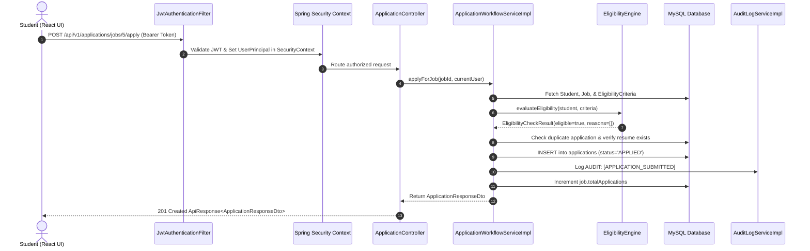
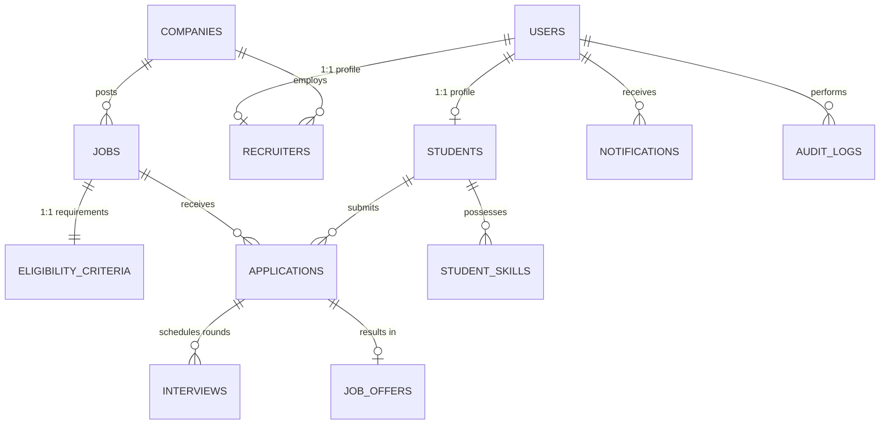

# 🚀 Smart Placement Management System — Complete Learning Guide (Hinglish)

> **Welcome beginner Java & Spring Boot developer!**  
> Yeh guide tumhare liye banayi gayi hai taaki tum is poore enterprise full-stack project ke har ek component, flow, database table, aur Spring Boot concept ko bilkul simple aur friendly Hinglish me samajh sako.

---

## 📑 Table of Contents
1. [Project Overview (Yeh Project Kya Karta Hai?)](#1-project-overview)
2. [Folder Structure & Architecture Layout](#2-folder-structure--architecture-layout)
3. [Spring Boot Concepts Used (What, Why, How, Exact File)](#3-spring-boot-concepts-used)
4. [End-to-End Flow: "Student Applies for a Job" (File by File)](#4-end-to-end-flow-student-applies-for-a-job)
5. [End-to-End Flow: JWT Authentication & Security (File by File)](#5-end-to-end-flow-jwt-authentication--security)
6. [Eligibility Engine (Strategy Pattern) & Adding a New Rule](#6-eligibility-engine--adding-a-new-rule)
7. [Database Tables & Relationships Explained](#7-database-tables--relationships-explained)
8. [20 Frequently Asked Interview Questions & Answers](#8-20-interview-questions--answers)
9. [7-Day Hands-on Study Plan with Mini Exercises](#9-7-day-study-plan)

---

## 1. Project Overview

### 💡 Real-World Problem
Har saal engineering colleges me campus placement season aati hai. Hazaron students hote hain, darjano companies aati hain, har company ki apni eligibility rules hoti hain (jaise: *"Minimum 7.5 CGPA, max 1 backlog, only CSE/IT branch, 12th me 70%+"*).  
Manual spreadsheets (Excel sheets) se manage karne me bohot galtiyan hoti hain:
- Ineligible students apply kar dete hain.
- Companies shortlist track nahi kar paati.
- TPO (Training & Placement Office) ko pata nahi chalta ki kaun student placed ho chuka hai aur kaun bacha hai.
- Compliance reports (NAAC, NIRF) ke liye data manually compile karna padta hai jisme hafte nikal jate hain.

### 🎯 Our Solution: Smart Placement Management System
Yeh ek automated, rule-driven, role-based platform hai jo campus placement ko end-to-end automate karta hai.

### 👥 Three Core Roles
1. **Student (`ROLE_STUDENT`)**:
   - Register karta hai, profile aur academic details (CGPA, backlogs, branch, skills) bharta hai.
   - Resume upload karta hai (PDF format with secure validation).
   - Live drives browse karta hai; system real-time batata hai ki student eligible hai ya nahi (aur reason bhi batata hai).
   - 1-click me apply karta hai, interview rounds track karta hai, job offers accept/decline karta hai.
2. **Recruiter (`ROLE_RECRUITER`)**:
   - Company profile create karta hai aur placement drives post karta hai.
   - Complex eligibility criteria set karta hai (CGPA, branch, backlog count, graduation year, marks).
   - Candidates ki applications view karta hai, resume download karta hai, stage update karta hai (APPLIED -> SHORTLISTED -> TECHNICAL -> HR -> SELECTED).
   - Interview schedule karta hai (meet link, round type, date-time).
   - Selected students ko officially Job Offer issue karta hai (with CTC details & deadline).
3. **TPO Admin (`ROLE_TPO_ADMIN`)**:
   - Institutional control center: overall placement rate, department-wise analytics, salary tiers track karta hai.
   - Student database manage karta hai, companies ko verify karta hai.
   - Tamper-evident Audit Logs inspect karta hai.
   - 1-click me government-compliant NAAC / NIRF master placement CSV report export karta hai.

---

## 2. Folder Structure & Architecture Layout

### 📁 Overall Workspace
```text
smart-placement-system/
├── pom.xml                               # Backend Maven configuration & dependencies
├── mvnw / mvnw.cmd                       # Maven wrapper (bina system Maven install kiye chalane ke liye)
├── src/
│   ├── main/
│   │   ├── java/com/smartplacement/      # Core Java backend source code
│   │   └── resources/
│   │       ├── application.yml           # Database, JWT, storage configuration
│   │       └── schema.sql                # Optional initial SQL schemas
│   └── test/                             # 87 automated hermetic unit & integration tests
├── frontend/                             # React 18 + Vite modern Single Page Application (SPA)
│   ├── package.json
│   ├── vite.config.js
│   └── src/
│       ├── components/ui/                # Reusable design system (Button, Modal, Card, DataTable, etc.)
│       ├── pages/                        # AuthPage, StudentPortal, RecruiterPortal, TpoAdminPortal
│       ├── services/                     # Axios API clients & interceptors
│       └── index.css                     # Global design tokens and styles
└── docs/                                 # Documentation & architecture specifications
```

### ☕ Backend Package Architecture (`src/main/java/com/smartplacement/`)
Hamara backend **Standard 3-Tier Layered Architecture** follow karta hai:

| Package | Purpose |
|---|---|
| [`config/`](file:///c:/Users/HP%20R5/OneDrive/Desktop/smart-placement-system/smart-placement-system/src/main/java/com/smartplacement/config) | Security filter chain, CORS setup, OpenAPI documentation, and initial seed data ([`DataInitializer.java`](file:///c:/Users/HP%20R5/OneDrive/Desktop/smart-placement-system/smart-placement-system/src/main/java/com/smartplacement/config/DataInitializer.java)). |
| [`controller/`](file:///c:/Users/HP%20R5/OneDrive/Desktop/smart-placement-system/smart-placement-system/src/main/java/com/smartplacement/controller) | REST API endpoints jo HTTP requests receive karte hain, input validate karte hain, aur JSON response return karte hain. |
| [`service/`](file:///c:/Users/HP%20R5/OneDrive/Desktop/smart-placement-system/smart-placement-system/src/main/java/com/smartplacement/service) | Business logic interfaces. |
| [`service/impl/`](file:///c:/Users/HP%20R5/OneDrive/Desktop/smart-placement-system/smart-placement-system/src/main/java/com/smartplacement/service/impl) | Business logic implementations: application workflows, job management, student profile, interviews, notifications, audit logging. |
| [`engine/eligibility/`](file:///c:/Users/HP%20R5/OneDrive/Desktop/smart-placement-system/smart-placement-system/src/main/java/com/smartplacement/engine/eligibility) | Pluggable Strategy-pattern rule engine jo candidate eligibility calculate karta hai. |
| [`repository/`](file:///c:/Users/HP%20R5/OneDrive/Desktop/smart-placement-system/smart-placement-system/src/main/java/com/smartplacement/repository) | Spring Data JPA interfaces jo MySQL database se direct communication karte hain (SQL queries automatically generate hoti hain). |
| [`entity/`](file:///c:/Users/HP%20R5/OneDrive/Desktop/smart-placement-system/smart-placement-system/src/main/java/com/smartplacement/entity) | JPA Entities jo database tables se 1-to-1 map hoti hain (Hibernate ORM). |
| [`dto/`](file:///c:/Users/HP%20R5/OneDrive/Desktop/smart-placement-system/smart-placement-system/src/main/java/com/smartplacement/dto) | Data Transfer Objects jo client aur server ke beech network data exchange karte hain (entities ko hide karte hain security ke liye). |
| [`security/`](file:///c:/Users/HP%20R5/OneDrive/Desktop/smart-placement-system/smart-placement-system/src/main/java/com/smartplacement/security) | JWT token parsing, user principal context, authentication exception handling, password hashing. |
| [`exception/`](file:///c:/Users/HP%20R5/OneDrive/Desktop/smart-placement-system/smart-placement-system/src/main/java/com/smartplacement/exception) | Centralized error handler (`@RestControllerAdvice`) jo uniform error JSON banata hai. |

---

## 3. Spring Boot Concepts Used

Har Spring Boot developer ko yeh 12 key concepts deeply pata hone chahiye. Aaiye inko **What**, **Why**, **How**, aur **Exact File** ke sath samjhein:

### 1. `@SpringBootApplication`
- **What**: Yeh ek meta-annotation hai jo teen annotations ka combination hai: `@Configuration`, `@EnableAutoConfiguration`, aur `@ComponentScan`.
- **Why**: Isse Spring Boot application bootstrap hoti hai aur poore project me Spring beans ko scan karke register karti hai.
- **How**: `main()` method me `SpringApplication.run(SmartPlacementApplication.class, args);` call hota hai.
- **Exact File**: [`SmartPlacementApplication.java`](file:///c:/Users/HP%20R5/OneDrive/Desktop/smart-placement-system/smart-placement-system/src/main/java/com/smartplacement/SmartPlacementApplication.java)

### 2. Dependency Injection & Inversion of Control (IoC)
- **What**: Objects khud apne dependencies (like `new Service()`) create nahi karte, balki Spring Container unhe inject karta hai.
- **Why**: Loose coupling aur easy testing (Mocking) ke liye.
- **How**: Hamne poore project me **Constructor Injection** use kiya hai (jo best practice maani jaati hai).
- **Exact File Example**: [`ApplicationWorkflowServiceImpl.java`](file:///c:/Users/HP%20R5/OneDrive/Desktop/smart-placement-system/smart-placement-system/src/main/java/com/smartplacement/service/impl/ApplicationWorkflowServiceImpl.java) me `studentRepository`, `jobRepository`, `eligibilityEngine` constructor se inject hote hain.

### 3. `@RestController` & `@RequestMapping`
- **What**: `@RestController` = `@Controller` + `@ResponseBody`. Yeh batata hai ki class ke saare methods JSON ya XML response return karenge, HTML page nahi.
- **Why**: RESTful API create karne ke liye jise React frontend consume kar sake.
- **How**: `@GetMapping`, `@PostMapping`, `@PutMapping`, `@DeleteMapping` use karke HTTP verbs bind kiye jaate hain.
- **Exact File Example**: [`JobController.java`](file:///c:/Users/HP%20R5/OneDrive/Desktop/smart-placement-system/smart-placement-system/src/main/java/com/smartplacement/controller/JobController.java) (`@RequestMapping("/api/v1/jobs")`).

### 4. DTO Pattern & Bean Validation (`@Valid`, `@NotNull`, etc.)
- **What**: Database Entity ko direct client ko expose nahi karte. Uske badle DTO (Data Transfer Object) use karte hain aur uspe Jakarta Validation lagate hain.
- **Why**: Security (mass-assignment vulnerability rokne ke liye) aur automatic input validation ke liye.
- **How**: Request body par `@Valid` lagaya jata hai, aur DTO class me `@NotBlank`, `@Min`, `@Email` lagate hain.
- **Exact File Example**: [`StudentRegisterRequestDto.java`](file:///c:/Users/HP%20R5/OneDrive/Desktop/smart-placement-system/smart-placement-system/src/main/java/com/smartplacement/dto/auth/StudentRegisterRequestDto.java) & [`JobCreateRequestDto.java`](file:///c:/Users/HP%20R5/OneDrive/Desktop/smart-placement-system/smart-placement-system/src/main/java/com/smartplacement/dto/job/JobCreateRequestDto.java).

### 5. Centralized Exception Handling (`@RestControllerAdvice`)
- **What**: Ek aisi class jo pure application me kahin bhi throw hone wale exceptions ko catch karti hai.
- **Why**: Har controller me `try-catch` likhne ki zaroorat nahi padti. User ko hamesha standardized `{ success: false, message: "...", error: "..." }` JSON milta hai.
- **How**: Class par `@RestControllerAdvice` aur method par `@ExceptionHandler(ResourceNotFoundException.class)` lagate hain.
- **Exact File**: [`GlobalExceptionHandler.java`](file:///c:/Users/HP%20R5/OneDrive/Desktop/smart-placement-system/smart-placement-system/src/main/java/com/smartplacement/exception/GlobalExceptionHandler.java).

### 6. Spring Data JPA (`JpaRepository`)
- **What**: Spring ka ek module jo database queries likhna 90% eliminate kar deta hai.
- **Why**: Boilerplate JDBC code (Connection, Statement, ResultSet) nahi likhna padta.
- **How**: Bas interface declare karo: `public interface StudentRepository extends JpaRepository<Student, Long>`. Spring runtime par iski implementation khud bana deta hai!
- **Exact File Example**: [`StudentRepository.java`](file:///c:/Users/HP%20R5/OneDrive/Desktop/smart-placement-system/smart-placement-system/src/main/java/com/smartplacement/repository/StudentRepository.java).

### 7. Entity Lifecycle & Auditing (`@MappedSuperclass`, `@CreatedDate`)
- **What**: Common columns jaise `created_at`, `updated_at` ko har entity me bar-bar define karne ke bajaye ek base class me rakhna.
- **Why**: DRY principle (Don't Repeat Yourself) aur consistent audit timestamps.
- **How**: Base class par `@MappedSuperclass` aur `@EntityListeners(AuditingEntityListener.class)` lagao.
- **Exact File**: [`BaseEntity.java`](file:///c:/Users/HP%20R5/OneDrive/Desktop/smart-placement-system/smart-placement-system/src/main/java/com/smartplacement/entity/BaseEntity.java).

### 8. `@Transactional`
- **What**: Database transactions ko manage karta hai (ACID properties ensure karta hai).
- **Why**: Agar job apply karte waqt application create ho gayi par audit log fail ho gaya, to half-done changes roll back ho jaate hain taaki database corrupt na ho.
- **How**: Service method par `@Transactional` lagao.
- **Exact File Example**: [`JobServiceImpl.java`](file:///c:/Users/HP%20R5/OneDrive/Desktop/smart-placement-system/smart-placement-system/src/main/java/com/smartplacement/service/impl/JobServiceImpl.java) & [`ApplicationWorkflowServiceImpl.java`](file:///c:/Users/HP%20R5/OneDrive/Desktop/smart-placement-system/smart-placement-system/src/main/java/com/smartplacement/service/impl/ApplicationWorkflowServiceImpl.java).

### 9. Spring Security Filter Chain & JWT
- **What**: Har aane wali HTTP request ko controller tak pahunchne se pehle inspect karne ka mechanism.
- **Why**: Authentication (aap kaun ho?) aur Authorization (kya aapke paas yeh role hai?) check karne ke liye.
- **How**: `SecurityFilterChain` bean define karke routes protect kiye jaate hain, aur `JwtAuthenticationFilter` me token verify hota hai.
- **Exact File**: [`SecurityConfig.java`](file:///c:/Users/HP%20R5/OneDrive/Desktop/smart-placement-system/smart-placement-system/src/main/java/com/smartplacement/config/SecurityConfig.java).

### 10. `PasswordEncoder` (BCrypt)
- **What**: Strong one-way password hashing algorithm with automatic salt generation.
- **Why**: Database me plain-text password store karna illegal aur insecure hai. Agar database leak bhi ho jaye, koi password decode nahi kar sakta.
- **How**: `BCryptPasswordEncoder` bean banaya aur register/login me `passwordEncoder.encode()` aur `matches()` use kiya.
- **Exact File**: [`SecurityConfig.java`](file:///c:/Users/HP%20R5/OneDrive/Desktop/smart-placement-system/smart-placement-system/src/main/java/com/smartplacement/config/SecurityConfig.java) & [`AuthServiceImpl.java`](file:///c:/Users/HP%20R5/OneDrive/Desktop/smart-placement-system/smart-placement-system/src/main/java/com/smartplacement/service/impl/AuthServiceImpl.java).

### 11. `CommandLineRunner` (Seed Data Initializer)
- **What**: Spring Boot start hone ke turant baad chalne wala code hook.
- **Why**: Pehle se default TPO Admin aur test data database me initialize karne ke liye taaki fresh setup par app turant usable ho.
- **How**: Class implements `CommandLineRunner` aur `run(String... args)` method override karti hai.
- **Exact File**: [`DataInitializer.java`](file:///c:/Users/HP%20R5/OneDrive/Desktop/smart-placement-system/smart-placement-system/src/main/java/com/smartplacement/config/DataInitializer.java).

### 12. CORS Configuration (`WebMvcConfigurer`)
- **What**: Cross-Origin Resource Sharing. Browser ki security policy allow karti hai ki port 5173 (React) port 8080 (Spring Boot) se API call kar sake.
- **Why**: Agar CORS configure na ho, to browser API call ko block kar deta hai ("CORS error").
- **How**: `addCorsMappings(CorsRegistry registry)` method override karke `http://localhost:5173` allow kiya.
- **Exact File**: [`WebMvcConfig.java`](file:///c:/Users/HP%20R5/OneDrive/Desktop/smart-placement-system/smart-placement-system/src/main/java/com/smartplacement/config/WebMvcConfig.java).

---

## 4. End-to-End Flow: "Student Applies for a Job"

Aaiye trace karein ki jab Student browser me **"Apply for Drive"** button dabata hai, to under-the-hood kya hota hai:



### File-by-File Detailed Walkthrough:
1. **Frontend Request**:
   - Student clicks "Apply" on Job ID `5`.
   - `frontend/src/services/api.js` request bhejta hai:
     `POST /api/v1/applications/jobs/5/apply` with header `Authorization: Bearer <jwt_token>`.
2. **`JwtAuthenticationFilter.java`**:
   - Request intercept hoti hai. Token extract karke `jwtTokenProvider.validateToken()` call hota hai.
   - User email extract hota hai (`student@univ.edu`), database se user details load hoti hain aur `SecurityContextHolder` me authentication set ho jata hai.
3. **`SecurityConfig.java`**:
   - Verify karta hai ki route `/api/v1/applications/**` par request bhejne wale ke paas `ROLE_STUDENT` hai ya nahi.
4. **`ApplicationController.java`**:
   - Method `@PostMapping("/jobs/{jobId}/apply")` trigger hota hai.
   - Current logged-in user ko `@AuthenticationPrincipal UserPrincipal currentUser` se inject karta hai aur service ko call karta hai:
     `applicationWorkflowService.applyForJob(jobId, currentUser);`
5. **`ApplicationWorkflowServiceImpl.java`**:
   - `studentRepository.findByUserId(currentUser.getId())` se student fetch karta hai.
   - Check karta hai ki kya student ne resume upload kiya hai (`student.getResumeUrl() != null`). Agar nahi hai, to `BadRequestException` throw hota hai.
   - `jobRepository.findById(jobId)` se job fetch karta hai. Check karta hai ki job `OPEN` hai ya nahi aur deadline expire to nahi hui.
   - `applicationRepository.findByStudentIdAndJobId(studentId, jobId)` se check karta hai ki student ne pehle se apply to nahi kiya hua.
   - **Engine Invocation**: `eligibilityEngine.evaluate(student, job.getEligibilityCriteria())` call karta hai.
6. **`EligibilityEngine.java`**:
   - 7 evaluators loop me chalte hain. Agar koi bhi rule fail hota hai (e.g. CGPA kam hai ya branch match nahi hoti), to result me `eligible = false` aur exact reason string add ho jati hai.
   - Agar fail hota hai, service `BadRequestException` throw karti hai with reason: *"Student is not eligible for this drive: Branch 'MECHANICAL' is not allowed."*
7. **Database Persistence**:
   - Agar eligible hai, nayi `Application` entity banti hai with status `ApplicationStatus.APPLIED`.
   - `applicationRepository.save(application)` se record insert hota hai.
8. **Audit & Notifications**:
   - `auditLogService.logAction(...)` se immutable audit log record hota hai.
   - `notificationService.createNotification(...)` se student ko notification bhej di jaati hai.
9. **Response**:
   - `ApplicationResponseDto` banakar `ApiResponse.created(...)` me wrap karke JSON return ho jata hai (HTTP 201).

---

## 5. End-to-End Flow: JWT Authentication & Security

JWT (JSON Web Token) stateless authentication ka standard hai. Session database me store nahi hota; token ke andar hi user ki identity cryptographically signed hoti hai.

```mermaid
graph TD
    subgraph Login Flow
        A[Client: POST /api/v1/auth/login] --> B[AuthController]
        B --> C[AuthServiceImpl]
        C --> D[AuthenticationManager.authenticate]
        D --> E[CustomUserDetailsService loads User]
        D --> F[BCrypt Password Verification]
        F --> G[JwtTokenProvider generates signed JWT]
        G --> H[Return AuthResponseDto with Token]
    end

    subgraph Authenticated Request Flow
        I[Client: GET /api/v1/jobs with Bearer Token] --> J[JwtAuthenticationFilter]
        J --> K{Token Valid?}
        K -- No --> L[JwtAuthenticationEntryPoint: 401 Unauthorized]
        K -- Yes --> M[Extract User Email & Roles]
        M --> N[Set SecurityContextHolder]
        N --> O{Role Authorized?}
        O -- No --> P[CustomAccessDeniedHandler: 403 Forbidden]
        O -- Yes --> Q[Target Controller Method executes]
    end
```



### Core Security Files:
1. [`JwtTokenProvider.java`](file:///c:/Users/HP%20R5/OneDrive/Desktop/smart-placement-system/smart-placement-system/src/main/java/com/smartplacement/security/jwt/JwtTokenProvider.java):
   - HMAC-SHA256 key use karke JWT token create karta hai (`generateToken()`) jisme `subject` (user email), `issuedAt`, `expiration`, aur custom claims hote hain.
   - `validateToken()` method signature check karta hai, token expiry check karta hai, aur tampering detect karta hai.
2. [`JwtAuthenticationFilter.java`](file:///c:/Users/HP%20R5/OneDrive/Desktop/smart-placement-system/smart-placement-system/src/main/java/com/smartplacement/security/jwt/JwtAuthenticationFilter.java):
   - `OncePerRequestFilter` ko extend karta hai (taaki ek HTTP request me ek hi baar chale).
   - `Authorization: Bearer <token>` header parse karta hai.
3. [`CustomUserDetailsService.java`](file:///c:/Users/HP%20R5/OneDrive/Desktop/smart-placement-system/smart-placement-system/src/main/java/com/smartplacement/security/CustomUserDetailsService.java):
   - Spring Security ka interface implement karta hai. Email se `User` record fetch karta hai aur `UserPrincipal` return karta hai.
4. [`JwtAuthenticationEntryPoint.java`](file:///c:/Users/HP%20R5/OneDrive/Desktop/smart-placement-system/smart-placement-system/src/main/java/com/smartplacement/security/jwt/JwtAuthenticationEntryPoint.java):
   - Jab unauthenticated user protected resource access karta hai, to default HTML 401 page ke bajaye clean JSON return karta hai:
     ```json
     { "success": false, "status": 401, "error": "Unauthorized", "message": "Full authentication is required..." }
     ```
5. [`CustomAccessDeniedHandler.java`](file:///c:/Users/HP%20R5/OneDrive/Desktop/smart-placement-system/smart-placement-system/src/main/java/com/smartplacement/security/jwt/CustomAccessDeniedHandler.java):
   - Jab authenticated user (e.g. Student) aisi API call karta hai jo sirf Admin ke liye allowed hai, to HTTP 403 Forbidden JSON return karta hai.

---

## 6. Eligibility Engine & Adding a New Rule

### 🧠 The Strategy Pattern Design
Eligibility engine ko hardcoded `if-else` blocks se nahi banaya gaya. Agar 10 rules hon aur ek naya rule add karna ho, to purana service code modify karna padta jo **Open/Closed Principle** (SOLID) ko violate karta.  
Isliye hamne **Strategy Pattern** use kiya hai:

```text
com.smartplacement.engine.eligibility/
├── EligibilityEvaluator.java           # Strategy Interface
├── EligibilityCheckResult.java         # Result DTO (eligible boolean, List<String> reasons)
├── EligibilityEngine.java              # Engine orchestrator
└── evaluators/
    ├── MinCgpaEvaluator.java           # Checks student.cgpa >= criteria.minCgpa
    ├── MaxBacklogsEvaluator.java       # Checks student.activeBacklogs <= criteria.maxBacklogs
    ├── EligibleBranchesEvaluator.java  # Checks criteria.eligibleBranches.contains(student.branch)
    ├── GraduationYearEvaluator.java    # Checks student.graduationYear == criteria.graduationYear
    ├── MinTenthMarksEvaluator.java     # Checks 10th board percentage
    ├── MinTwelfthMarksEvaluator.java   # Checks 12th board percentage
    └── RequiredSkillsEvaluator.java    # Checks student has required skills
```

### How `EligibilityEngine` Discovers Evaluators:
Spring Boot me jab aap constructor me `List<EligibilityEvaluator>` mangte ho:
```java
@Service
public class EligibilityEngine {
    private final List<EligibilityEvaluator> evaluators;

    public EligibilityEngine(List<EligibilityEvaluator> evaluators) {
        this.evaluators = evaluators; // Spring automatically collects ALL @Component evaluators!
    }
}
```
Spring Boot application context me jitne bhi classes `EligibilityEvaluator` implement karti hain, Spring unka list banakar automatically inject kar deta hai!

---

### 🛠️ Tutorial: How to Add a New Eligibility Rule (e.g., "Maximum Gap Years")

Maan lijiye company ki requirement aati hai: *"Student ka 12th aur college ke beech 1 saal se zyada gap nahi hona chahiye."*  
Dekhiye kitni aasani se yeh naya rule add ho sakta hai:

#### Step 1: `EligibilityCriteria` entity me field add karein
In [`EligibilityCriteria.java`](file:///c:/Users/HP%20R5/OneDrive/Desktop/smart-placement-system/smart-placement-system/src/main/java/com/smartplacement/entity/EligibilityCriteria.java):
```java
@Column(name = "max_gap_years")
private Integer maxGapYears; // null means no gap restriction
```

#### Step 2: Nayi Evaluator Class banayein (`MaxGapYearsEvaluator.java`)
Under `com.smartplacement.engine.eligibility.evaluators`:
```java
package com.smartplacement.engine.eligibility.evaluators;

import com.smartplacement.engine.eligibility.EligibilityEvaluator;
import com.smartplacement.entity.EligibilityCriteria;
import com.smartplacement.entity.Student;
import org.springframework.stereotype.Component;

import java.util.Optional;

@Component // <-- Yeh annotation Spring ko batata hai ki yeh ek Bean hai
public class MaxGapYearsEvaluator implements EligibilityEvaluator {

    @Override
    public Optional<String> evaluate(Student student, EligibilityCriteria criteria) {
        if (criteria.getMaxGapYears() == null) {
            return Optional.empty(); // Rule not configured for this job -> PASS
        }
        
        int studentGapYears = student.getGapYears() != null ? student.getGapYears() : 0;
        
        if (studentGapYears > criteria.getMaxGapYears()) {
            return Optional.of(String.format(
                "Gap years exceeded: Maximum allowed is %d year(s), but student has %d gap year(s).",
                criteria.getMaxGapYears(), studentGapYears
            ));
        }
        
        return Optional.empty(); // Eligible -> PASS
    }
}
```

#### Step 3: Done! 🎉
Aapko `EligibilityEngine.java` ya `ApplicationWorkflowServiceImpl.java` me **1 line bhi code change karne ki zaroorat nahi hai!**  
Spring Boot restart hote hi is naye evaluator ko automatically detect karke rule-chain me shamil kar lega. Yeh hota hai professional enterprise architecture!

---

## 7. Database Tables & Relationships Explained

Hamari MySQL database 3NF (Third Normal Form) normalized hai aur 16 tables par structured hai:



### Table Details:
1. **`users`**: Master authentication table. Stores `email`, `password_hash`, `role` (`ROLE_STUDENT`, `ROLE_RECRUITER`, `ROLE_TPO_ADMIN`), `status` (`ACTIVE`, `INACTIVE`).
2. **`students`**: Academic profile. Stores `roll_number`, `first_name`, `last_name`, `cgpa`, `active_backlogs`, `branch`, `graduation_year`, `tenth_percentage`, `twelfth_percentage`, `resume_url`, `placement_status` (`UNPLACED`, `PLACED`).
3. **`companies`**: Organization details. Stores `name`, `website`, `industry`, `location`, `verified` (TPO verification status).
4. **`recruiters`**: Links a user to a specific company with corporate designation and phone.
5. **`jobs`**: Placement drive posting. Stores `company_id`, `title`, `description`, `job_type` (`FULL_TIME`, `INTERNSHIP`), `ctc`, `location`, `status` (`DRAFT`, `OPEN`, `CLOSED`), `deadline`.
6. **`eligibility_criteria`**: Job ke saath 1:1 mapped table jo cutoff rules define karti hai (`min_cgpa`, `max_backlogs`, `eligible_branches`, `graduation_year`, `min_tenth_marks`, `min_twelfth_marks`).
7. **`applications`**: Central join table jo Student aur Job ko connect karti hai. Tracks status (`APPLIED`, `SHORTLISTED`, `TECHNICAL_ROUND`, `HR_ROUND`, `SELECTED`, `REJECTED`, `WITHDRAWN`). Has unique index on `(student_id, job_id)` taaki duplicate application na ho sake.
8. **`interviews`**: Scheduled interview rounds with `interview_type`, `round_number`, `scheduled_at`, `meeting_link`, `feedback`, `status`.
9. **`job_offers`**: Formal placement offers issued to selected candidates. Stores `ctc_offered`, `valid_until`, `status` (`OFFERED`, `ACCEPTED`, `DECLINED`, `EXPIRED`).
10. **`audit_logs`**: Regulatory security log. Har sensitive action (application, offer, status change) ka timestamp, performer email, role, action type, IP address record karta hai.

---

## 8. 20 Frequently Asked Interview Questions & Answers

### Q1: What is the difference between `@Component`, `@Service`, and `@Repository`?
**Ans**: Teeno Spring beans create karte hain (`@Component` ke stereotypes hain). 
- `@Component`: General-purpose bean.
- `@Service`: Business logic layer ko represent karta hai (clarity ke liye).
- `@Repository`: Data Access Layer ke liye hota hai aur automatic persistence exception translation provide karta hai (e.g., SQL exceptions convert to Spring's DataAccessException).

### Q2: Why is Constructor Injection preferred over `@Autowired` on fields?
**Ans**: Field injection se class tightly-coupled ho jaati hai aur unit tests me bina Spring context ke dependencies mock karna mushkil hota hai. Constructor injection se dependencies `final` declare ki ja sakti hain (immutability), aur compile-time par missing dependency detect ho jati hai.

### Q3: What is the N+1 query problem in JPA/Hibernate and how do you solve it?
**Ans**: Jab aap 1 entity fetch karte hain aur uski child entities ko lazy-load karne ke liye Hibernate N additional queries fire karta hai, use N+1 problem kehte hain. Isko solve karne ke liye `JOIN FETCH` (JPQL), `@EntityGraph`, ya batch fetching use kiya jata hai.

### Q4: How does Spring Security authenticate a user via JWT?
**Ans**: Request aane par `JwtAuthenticationFilter` HTTP header se Bearer token extract karta hai. `JwtTokenProvider` HMAC secret se token ka signature verify karta hai. Valid hone par token se username/claims nikal kar `SecurityContextHolder.getContext().setAuthentication(auth)` set kar diya jata hai.

### Q5: What is the difference between 401 Unauthorized and 403 Forbidden?
**Ans**:
- **401 Unauthorized**: User authenticated nahi hai (token missing ya invalid hai). *"Aap kaun hain?"*
- **403 Forbidden**: User authenticated hai lekin uske paas us resource ke liye zaroori Role/Permission nahi hai. *"Aap kaun hain hum jaante hain, lekin aapko yahan jaane ki permission nahi hai."*

### Q6: What does `@Transactional` do behind the scenes?
**Ans**: Spring AOP (Aspect-Oriented Programming) use karke method ke around ek proxy banata hai. Method shuru hone par database transaction start hota hai (`conn.setAutoCommit(false)`). Agar method successfully return ho jaye to `commit` hota hai, aur agar koi `RuntimeException` throw ho to automatic `rollback` ho jata hai.

### Q7: What is the purpose of `@MappedSuperclass`?
**Ans**: Yeh batata hai ki is class ki apni alag database table nahi banegi, lekin iske fields (like `id`, `createdAt`, `updatedAt`) child entities ke database tables me columns ban kar inherit honge.

### Q8: What is the difference between DTO and Entity?
**Ans**: Entity database table ka direct representation hoti hai. DTO (Data Transfer Object) network layer ke liye customized data holder hota hai. DTO use karne se database structure expose nahi hota, over-fetching bach jati hai, aur sensitive data (like password hashes) leak nahi hota.

### Q9: How does `@RestControllerAdvice` work?
**Ans**: Yeh global interceptor hai jo Controller layer me aane wale kisi bhi exception ko catch karta hai. AOP ke zariye yeh `@ExceptionHandler` methods ko invoke karke client ko user-friendly error response deta hai.

### Q10: Why do we use BCrypt for passwords instead of MD5 or SHA-256?
**Ans**: MD5 aur plain SHA-256 bohot fast hote hain, jisse brute-force ya Rainbow Table attacks se passwords hack ho sakte hain. BCrypt ek adaptive slow hashing function hai jisme automatic salt add hota hai aur work-factor (cost) increase kiya ja sakta hai.

### Q11: Explain the Strategy Pattern used in this project's Eligibility Engine.
**Ans**: Strategy Pattern ek behavior ko define karne wale algorithms ko alag-alag classes me encapsulate karta hai. Hamne `EligibilityEvaluator` interface banaya aur har rule (CGPA, Backlogs, Branch) ko alag class banayi. Isse naye rules bina purana code chhede add ho jaate hain (Open/Closed Principle).

### Q12: What is the difference between JPA and Hibernate?
**Ans**: JPA (Jakarta Persistence API) ek specification/standard (set of interfaces) hai. Hibernate JPA ka actual implementation (ORM engine) hai jo un interfaces ko concrete code deta hai.

### Q13: What does `@Valid` do in a Controller method argument?
**Ans**: Yeh Spring ko batata hai ki incoming JSON payload ko DTO ke validation annotations (`@NotBlank`, `@Min`, etc.) ke against validate kare. Agar koi constraint violate hota hai, to `MethodArgumentNotValidException` throw hota hai jo GlobalExceptionHandler catch kar leta hai.

### Q14: How does file upload work securely in this project?
**Ans**: `LocalFileStorageServiceImpl` me uploaded PDF file ka size check hota hai (max 5MB), MIME type check hota (`application/pdf`), aur filename ko sanitize karke UUID-based unique filename banaya jata hai taaki path-traversal attacks (`../../`) roke ja sakein.

### Q15: What is CORS and why do we configure it in `WebMvcConfig`?
**Ans**: CORS (Cross-Origin Resource Sharing) browser ka security feature hai. Kyunki React app port 5173 par chal rahi hai aur Spring Boot port 8080 par, browser origin mismatch hone ki wajah se request block kar deta hai. `WebMvcConfig` me explicitly `allowedOrigins("http://localhost:5173")` allow kiya gaya hai.

### Q16: What is the difference between `findById()` and `getReferenceById()` in Spring Data JPA?
**Ans**: `findById()` turant database se actual record fetch karta hai (Eager). `getReferenceById()` ek proxy object return karta hai aur query tab tak nahi chalta jab tak us object ka koi non-ID property access na kiya jaye.

### Q17: Why do we implement `CommandLineRunner` in `DataInitializer`?
**Ans**: Taaki jaise hi Spring Boot application start ho, initialization code chale jo database me default roles, admin accounts aur seed companies check karke create kar de agar wo pehle se exist na karte hon.

### Q18: What is an Audit Log and why is it crucial for campus placement?
**Ans**: Audit log ek immutable history trail hoti hai jo batati hai ki kis user ne kab, kis IP se, kaun sa critical action perform kiya (e.g. application reject karna ya offer revoke karna). Yeh legal dispute aur college administrative transparency ke liye zaroori hai.

### Q19: What is the role of HikariCP in Spring Boot?
**Ans**: HikariCP high-performance, lightweight JDBC Connection Pool library hai jo Spring Boot me default hoti hai. Yeh database connections ko reuse karti hai taaki har HTTP request ke liye naya connection open/close na karna pade.

### Q20: How does Vite + React communicate with Spring Boot?
**Ans**: React frontend me Axios HTTP client use kiya gaya hai with Axios Request Interceptors. Interceptor har outgoing request me `localStorage` se JWT token nikal kar `Authorization: Bearer <token>` header automatically attach kar deta hai.

---

## 9. 7-Day Hands-on Study Plan with Mini Exercises

Is plan ko follow karke tum 1 week me is project ke master ban jaoge:

### 📅 Day 1: Project Setup & Layered Architecture
- **Goal**: Project ko local machine par run karna aur Controller-Service-Repository flow samajhna.
- **Read**: `SmartPlacementApplication.java`, `HealthController.java`, `CompanyController.java`.
- **Mini Exercise**: 
  1. Backend aur Frontend dono start karo.
  2. Browser me `http://localhost:8080/v3/api-docs` khol kar dekho.
  3. `HealthController` me ek naya endpoint banao: `GET /api/v1/health/ping` jo return kare `"pong"`.

### 📅 Day 2: JPA Entities & Database Schema
- **Goal**: Hibernate mappings aur Relational constraints samajhna.
- **Read**: `User.java`, `Student.java`, `Job.java`, `EligibilityCriteria.java`.
- **Mini Exercise**:
  1. MySQL Workbench ya CLI se connect karke `SHOW TABLES;` run karo.
  2. Dekho kaise `Student` aur `User` ke beech `@OneToOne` mapping database me foreign key banati hai.
  3. `Student` entity me ek optional field add karo (e.g. `linkedinUrl`) aur test karo.

### 📅 Day 3: DTOs & Validation
- **Goal**: Input validation aur error handling master karna.
- **Read**: `StudentRegisterRequestDto.java`, `JobCreateRequestDto.java`, `GlobalExceptionHandler.java`.
- **Mini Exercise**:
  1. Postman se invalid registration request bhejo (e.g. invalid email format ya blank password).
  2. Dekho kaise `GlobalExceptionHandler` error catch karke formatted JSON return karta hai.

### 📅 Day 4: Spring Security & JWT
- **Goal**: Authentication filter chain aur RBAC ko step-by-step debug karna.
- **Read**: `SecurityConfig.java`, `JwtTokenProvider.java`, `JwtAuthenticationFilter.java`.
- **Mini Exercise**:
  1. `POST /api/v1/auth/login` se token generate karo.
  2. Ek online tool ([jwt.io](https://jwt.io)) par token paste karke header, payload aur expiration time decode karke dekho.
  3. Bina token ke `/api/v1/jobs` access karne ki koshish karo aur 401 response verify karo.

### 📅 Day 5: Pluggable Eligibility Engine (Strategy Pattern)
- **Goal**: Strategy pattern ko practically implement karna.
- **Read**: `EligibilityEngine.java`, `EligibilityEvaluator.java`, `MinCgpaEvaluator.java`.
- **Mini Exercise**:
  1. Section 6 me diye gaye guide ke anusaar ek naya evaluator class banao (e.g. minimum 10th marks rule).
  2. Test run karke verify karo ki in-eligible student apply karne par sahi error message pata hai ya nahi.

### 📅 Day 6: Workflow & Transaction Management
- **Goal**: State machines aur business workflows trace karna.
- **Read**: `ApplicationWorkflowServiceImpl.java`, `JobOfferServiceImpl.java`.
- **Mini Exercise**:
  1. Student portal se drive apply karo.
  2. Recruiter portal me jakar application ko `SHORTLISTED` aur fir `SELECTED` mark karo.
  3. Database me `applications` table ka `status` column check karo.

### 📅 Day 7: Automated Testing & Packaging
- **Goal**: Hermetic unit and integration testing samajhna.
- **Read**: `JobControllerIntegrationTest.java`, `ApplicationControllerIntegrationTest.java`.
- **Mini Exercise**:
  1. Command prompt par `.\mvnw.cmd test` run karo aur dekho kaise saare 87 tests H2 in-memory database par run hote hain.
  2. Ek naya test case likho jo verify kare ki unregistered user login fail hota hai.

---
*Happy Learning! Agar koi bhi doubt aaye to code files me diye gaye clear comments aur unit tests ko zaroor refer karein.*
