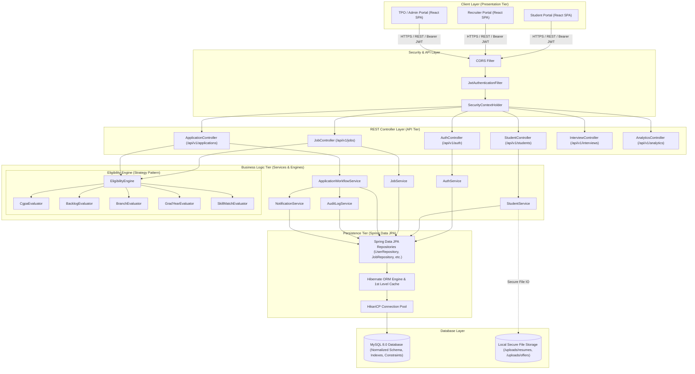
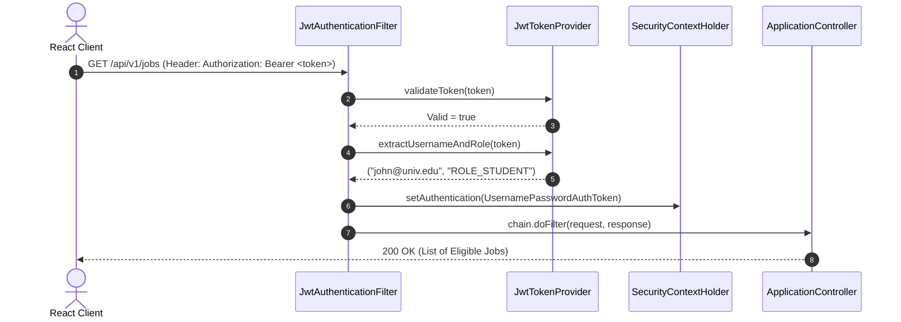
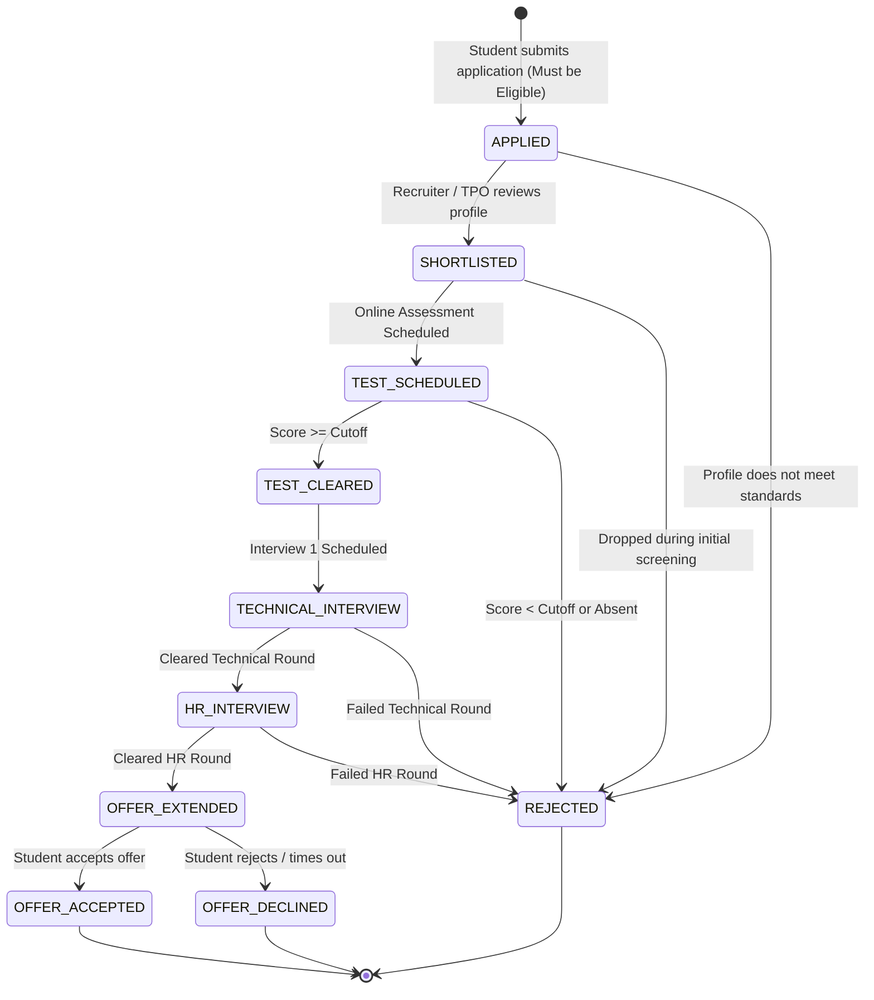
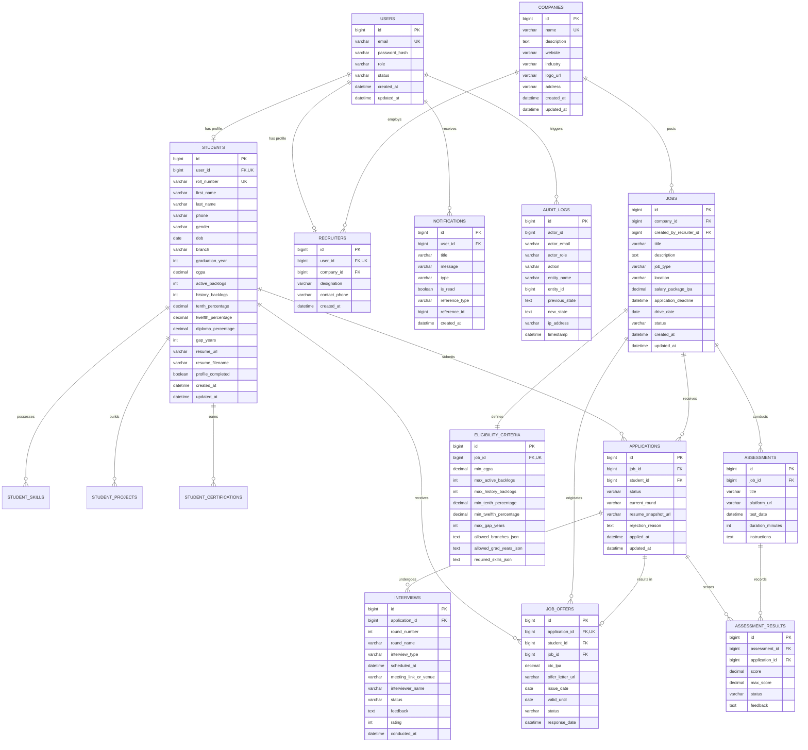

# Smart Placement Management System (SPMS)
## Phase 1: System Architecture, Database Design, API Specification & Development Roadmap

---

## 1. Executive Summary & High-Level Architecture

The **Smart Placement Management System (SPMS)** is an enterprise-grade web application engineered to modernize and automate campus recruitment operations for universities. In traditional setups, campus placements suffer from fragmented communication (email/WhatsApp), untracked spreadsheet evaluations, error-prone manual eligibility checks, lack of auditability, and delayed status notifications. 

SPMS replaces this with a **centralized, role-governed platform** featuring an automated **Rule-Based Eligibility Evaluation Engine**, dynamic multi-stage recruitment workflows, role-based analytics, and an audit trail.

### 1.1 System Architecture Style: Multi-Tier Layered Architecture

The application adopts an industry-standard **3-Tier Layered Architecture**:
1. **Presentation Tier**: Single Page Application (SPA) built using **React** with a responsive design system, delivering tailored dashboards for Students, Recruiters, and TPO Administrators.
2. **Application Tier (Backend)**: Built with **Java 21 / 25 LTS** and **Spring Boot 3.x**. Employs a strict **Controller-Service-Repository** pattern with stateless JWT authentication, declarative transactions, pluggable strategy-based business rules, and global exception mapping.
3. **Data Tier (Persistence)**: **MySQL 8.0** relational database managed via **Spring Data JPA** and **Hibernate ORM**, with HikariCP connection pooling, foreign-key relational integrity, and indexed query paths.



---

## 2. Core Java & Spring Boot Foundations (Teaching Mode)

As you are learning Java and Spring Boot, this section explains the **six pillars** of backend engineering that we will implement across all upcoming phases. Every concept is broken down into: **What it is**, **Why needed**, **How it works**, and a **Conceptual Code Example**.

---

### Concept 1: The Controller-Service-Repository Layered Pattern

#### 1. What it is
A software architectural pattern that divides the backend into three distinct layers of responsibility:
- **Controller Layer**: Handles incoming HTTP requests, extracts parameters, triggers validation, and formats HTTP responses.
- **Service Layer**: Houses all core business rules, calculations, decision logic, and transaction boundaries.
- **Repository Layer**: Directly interacts with the database (SQL/ORM queries) to retrieve and store records.

#### 2. Why we need it
- **Separation of Concerns**: Prevents controllers from executing raw SQL queries or complex math. If database technology changes, controllers are unaffected.
- **Testability**: You can test business calculations (e.g. eligibility criteria) in isolation using unit tests without launching an HTTP web server or database.
- **Reusability**: Multiple controllers (or background jobs) can reuse the same business service logic.

#### 3. How it works
1. Client sends an HTTP request: `POST /api/v1/jobs/5/apply`.
2. `JobApplicationController` receives the request DTO, validates inputs using `@Valid`.
3. Controller delegates to `ApplicationWorkflowService.applyForJob(jobId, studentId)`.
4. The service fetches the student and job details via `StudentRepository` and `JobRepository`, runs the `EligibilityEngine`, creates an `Application` entity, and calls `ApplicationRepository.save(...)`.
5. The service returns a result DTO back to the controller, which wraps it in `ResponseEntity.status(HttpStatus.CREATED).body(responseDto)`.

#### 4. Conceptual Code Example
```java
// 1. Controller Layer: Only handles HTTP & routing
@RestController
@RequestMapping("/api/v1/applications")
public class ApplicationController {

    private final ApplicationService applicationService;

    // Dependency injection via constructor
    public ApplicationController(ApplicationService applicationService) {
        this.applicationService = applicationService;
    }

    @PostMapping("/jobs/{jobId}/apply")
    public ResponseEntity<ApiResponse<ApplicationResponseDto>> apply(
            @PathVariable Long jobId,
            @AuthenticationPrincipal UserPrincipal currentUser) {
        
        ApplicationResponseDto result = applicationService.applyForJob(jobId, currentUser.getId());
        return ResponseEntity.status(HttpStatus.CREATED)
                             .body(ApiResponse.success("Application submitted successfully", result));
    }
}

// 2. Service Layer: Contains business logic & transaction control
@Service
public class ApplicationService {

    private final ApplicationRepository applicationRepository;
    private final JobRepository jobRepository;
    private final EligibilityEngine eligibilityEngine;

    public ApplicationService(ApplicationRepository applicationRepository,
                              JobRepository jobRepository,
                              EligibilityEngine eligibilityEngine) {
        this.applicationRepository = applicationRepository;
        this.jobRepository = jobRepository;
        this.eligibilityEngine = eligibilityEngine;
    }

    @Transactional // Ensures atomicity (all DB changes succeed or all rollback)
    public ApplicationResponseDto applyForJob(Long jobId, Long studentId) {
        Job job = jobRepository.findById(jobId)
            .orElseThrow(() -> new ResourceNotFoundException("Job not found with ID: " + jobId));

        // Evaluate business rule
        EligibilityResult result = eligibilityEngine.evaluate(studentId, job.getEligibilityCriteria());
        if (!result.isEligible()) {
            throw new IneligibleApplicationException("Student ineligible: " + result.getReasonSummary());
        }

        Application application = new Application(job, studentId, ApplicationStatus.APPLIED);
        Application saved = applicationRepository.save(application);
        return ApplicationResponseDto.fromEntity(saved);
    }
}

// 3. Repository Layer: Data access interface (Spring Data JPA creates implementation)
@Repository
public interface ApplicationRepository extends JpaRepository<Application, Long> {
    boolean existsByJobIdAndStudentId(Long jobId, Long studentId);
    List<Application> findByStudentId(Long studentId);
}
```

---

### Concept 2: Entities vs. Data Transfer Objects (DTOs)

#### 1. What it is
- An **Entity** (`@Entity`) is a Java class directly mapped to a relational database table row via JPA/Hibernate.
- A **DTO (Data Transfer Object)** is a plain Java class (or modern Java `record`) tailored specifically for transferring data between client and server via network requests/responses.

#### 2. Why we need it
- **Security (Mass Assignment Vulnerability)**: If you expose an Entity directly in a controller, a malicious client could send JSON with `{"role": "ROLE_ADMIN", "cgpa": 10.0}` and overwrite protected fields.
- **Decoupling**: Database schema design should not dictate the external public API. You can change table column names without breaking mobile apps or frontend clients.
- **Performance & Circular References**: JPA entities often have bidirectional relationships (e.g., `Student` has many `Applications`, `Application` belongs to `Student`). Serializing entities directly into JSON causes infinite loops (`StackOverflowError`). DTOs avoid this completely.

#### 3. How it works
- **Request**: Client JSON $\to$ Controller parses into `JobCreateRequestDto` $\to$ Service maps DTO to `Job` entity $\to$ Saved to DB.
- **Response**: Entity fetched from DB $\to$ Service maps `Job` entity to `JobSummaryResponseDto` $\to$ Returned as JSON to Client.

#### 4. Conceptual Code Example
```java
// DATABASE ENTITY (Internal to server & DB)
@Entity
@Table(name = "students")
public class Student {
    @Id
    @GeneratedValue(strategy = GenerationType.IDENTITY)
    private Long id;

    @Column(nullable = false, unique = true)
    private String rollNumber;

    @Column(nullable = false)
    private Double cgpa;

    private Integer activeBacklogs;

    @OneToMany(mappedBy = "student", cascade = CascadeType.ALL)
    private List<Application> applications = new ArrayList<>();
    
    // Getters and setters...
}

// DTO FOR CLIENT RESPONSE (Clean, safe, no infinite JSON loops)
public record StudentProfileResponseDto(
    Long id,
    String rollNumber,
    String fullName,
    Double cgpa,
    Integer activeBacklogs,
    int totalApplicationsSubmitted
) {
    public static StudentProfileResponseDto fromEntity(Student s) {
        return new StudentProfileResponseDto(
            s.getId(),
            s.getRollNumber(),
            s.getFirstName() + " " + s.getLastName(),
            s.getCgpa(),
            s.getActiveBacklogs(),
            s.getApplications() != null ? s.getApplications().size() : 0
        );
    }
}
```

---

### Concept 3: Spring Data JPA & Hibernate ORM

#### 1. What it is
- **Hibernate** is an **ORM (Object-Relational Mapping)** framework. It bridges Java objects (classes, instances) with relational database tables (rows, columns).
- **Spring Data JPA** is a Spring abstraction layer over JPA/Hibernate that reduces boilerplate data access code to simple interface declarations.

#### 2. Why we need it
- Eliminates hundreds of lines of repetitive JDBC code (`Connection`, `PreparedStatement`, `ResultSet`, SQL string concatenation).
- Automatically prevents SQL Injection vulnerabilities by parameterizing all queries by default.
- Provides automatic schema validation, transaction management, pagination, sorting, and dirty checking (Hibernate automatically detects changed object attributes and issues SQL `UPDATE` statements).

#### 3. How it works
By extending `JpaRepository<T, ID>`, Spring automatically generates query implementations at runtime based on method names (called **Query Methods**).

#### 4. Conceptual Code Example
```java
public interface JobRepository extends JpaRepository<Job, Long> {

    // Spring Data JPA translates this method name into:
    // SELECT * FROM jobs WHERE status = ? AND application_deadline > ?
    List<Job> findByStatusAndApplicationDeadlineAfter(JobStatus status, LocalDateTime now);

    // Custom JPQL (Java Persistence Query Language) query:
    @Query("SELECT j FROM Job j JOIN FETCH j.eligibilityCriteria WHERE j.id = :jobId")
    Optional<Job> findByIdWithCriteria(@Param("jobId") Long jobId);
}
```

---

### Concept 4: Inversion of Control (IoC) & Dependency Injection (DI)

#### 1. What it is
- **Inversion of Control (IoC)**: Instead of your class instantiating its own dependencies using `new Object()`, the framework (Spring's ApplicationContext) creates and manages all objects (called **Spring Beans**).
- **Dependency Injection (DI)**: The mechanism where Spring injects required collaborator beans into dependent classes via constructors.

#### 2. Why we need it
- **Loose Coupling**: Components depend on abstractions (interfaces) rather than concrete implementations.
- **Easy Mocking/Testing**: When testing `ApplicationService`, you can inject a mock repository instead of needing a real database.

#### 3. How it works
Spring scans `@Component`, `@Service`, `@Repository`, and `@RestController` annotations during startup, instantiates singletons in memory, and passes them to constructors.

#### 4. Conceptual Code Example
```java
// BAD PRACTICE (Tight Coupling - Hard to test or substitute)
public class BadStudentService {
    private StudentRepository repo = new MySqlStudentRepositoryImpl(); // Hardcoded!
}

// SPRING BEST PRACTICE (Constructor Dependency Injection)
@Service
public class StudentService {
    private final StudentRepository studentRepository; // Immutable & final

    @Autowired // Optional in Spring 4.3+ when there is only one constructor
    public StudentService(StudentRepository studentRepository) {
        this.studentRepository = studentRepository; // Injected by Spring IoC container!
    }
}
```

---

### Concept 5: Spring Security & JWT Stateless Filter Chain

#### 1. What it is
- **Spring Security**: An enterprise framework providing authentication (verifying who you are) and authorization (verifying what you are allowed to do).
- **JWT (JSON Web Token)**: A compact, URL-safe, cryptographically signed token containing user claims (`userId`, `email`, `role`).
- **Stateless Architecture**: The server does NOT store HTTP sessions in memory. Every client request contains the token in the HTTP `Authorization: Bearer <token>` header.

#### 2. Why we need it
- Enables high scalability: Servers do not share in-memory session states. Any backend server can validate the cryptographically signed JWT without querying a central session cache.
- Standard protocol for modern React single-page applications and mobile clients.

#### 3. How it works
1. User submits email and password to `/api/v1/auth/login`.
2. `AuthenticationManager` verifies the credentials against the database using `BCryptPasswordEncoder`.
3. If valid, the server signs a JWT with a secret key and returns it.
4. On all subsequent requests, `JwtAuthenticationFilter` intercepts the request:
   - Extracts the token from header.
   - Validates signature and expiration date.
   - Extracts username and role (`ROLE_STUDENT`, `ROLE_TPO_ADMIN`, etc.).
   - Loads the authentication into `SecurityContextHolder`.
5. Spring Security authorizes or rejects the request based on `@PreAuthorize` rules.



---

### Concept 6: Global Exception Handling (`@RestControllerAdvice`)

#### 1. What it is
A centralized error-interceptor mechanism in Spring Boot that catches exceptions thrown anywhere in controllers, services, or repositories, and translates them into uniform, predictable JSON error responses.

#### 2. Why we need it
- Eliminates ugly `try-catch` blocks inside business logic and controllers.
- Prevents database stack traces and internal SQL errors from leaking to users (critical for security).
- Ensures that every error returned by the API has the exact same JSON format (`timestamp`, `status`, `error`, `message`, `path`, `fieldErrors`).

#### 3. How it works
Spring uses AOP (Aspect-Oriented Programming). When an uncaught exception is thrown, `@RestControllerAdvice` intercepts it and maps it to a method marked with `@ExceptionHandler(ExceptionType.class)`.

#### 4. Conceptual Code Example
```java
// Standard API Error Response Model
public record ApiErrorResponse(
    LocalDateTime timestamp,
    int status,
    String error,
    String message,
    String path,
    Map<String, String> validationErrors
) {}

// Centralized Interceptor
@RestControllerAdvice
public class GlobalExceptionHandler {

    @ExceptionHandler(ResourceNotFoundException.class)
    public ResponseEntity<ApiErrorResponse> handleNotFound(ResourceNotFoundException ex, HttpServletRequest request) {
        ApiErrorResponse error = new ApiErrorResponse(
            LocalDateTime.now(),
            HttpStatus.NOT_FOUND.value(),
            "Resource Not Found",
            ex.getMessage(),
            request.getRequestURI(),
            null
        );
        return new ResponseEntity<>(error, HttpStatus.NOT_FOUND);
    }

    @ExceptionHandler(MethodArgumentNotValidException.class)
    public ResponseEntity<ApiErrorResponse> handleValidationErrors(MethodArgumentNotValidException ex, HttpServletRequest req) {
        Map<String, String> fieldErrors = new HashMap<>();
        ex.getBindingResult().getFieldErrors().forEach(f -> fieldErrors.put(f.getField(), f.getDefaultMessage()));

        ApiErrorResponse error = new ApiErrorResponse(
            LocalDateTime.now(),
            HttpStatus.BAD_REQUEST.value(),
            "Validation Failed",
            "One or more fields have invalid values",
            req.getRequestURI(),
            fieldErrors
        );
        return new ResponseEntity<>(error, HttpStatus.BAD_REQUEST);
    }
}
```

---

## 3. User Roles & Granular Permission Matrix (RBAC)

The system enforces strict Role-Based Access Control (RBAC) across three principal personas:

| Role Name | Authority Identifier | Primary Responsibilities |
|---|---|---|
| **Student** | `ROLE_STUDENT` | Manages academic and professional profile, uploads resumes, browses companies/jobs, verifies real-time eligibility with detailed rejection explanations, applies for jobs, tracks application states, views interview schedules, and accepts/declines formal offers. |
| **Recruiter** | `ROLE_RECRUITER` | Manages company profile, creates and edits job postings and eligibility rules, views applicants and eligible candidate pools, downloads student resumes, updates candidate rounds (test/interview), conducts interviews, inputs feedback/ratings, and generates job offers. |
| **TPO / Admin** | `ROLE_TPO_ADMIN` | Exercises full administrative oversight over all students, recruiters, companies, and job drives. Can override eligibility, verify student credentials, publish campus-wide drives, schedule tests/interviews, broadcast notifications, export institutional placement reports, and monitor system audit logs. |

### 3.1 Resource-Level Access Control Matrix

| Resource / Action | Method & Endpoint Pattern | Student | Recruiter | TPO / Admin |
|---|---|:---:|:---:|:---:|
| **Register / Login** | `POST /api/v1/auth/**` | Public | Public | Admin Only |
| **View Own Student Profile** | `GET /api/v1/students/me` | Allowed | Denied | Denied |
| **Update Own Profile & Resume** | `PUT /api/v1/students/me/**` | Allowed | Denied | Denied |
| **View Any Student Full Profile** | `GET /api/v1/students/{id}` | Denied | If Applied/Eligible | Allowed |
| **Manage Companies** | `POST,PUT,DELETE /api/v1/companies/**` | Denied | Own Company | Allowed All |
| **Create / Publish Job Drive** | `POST /api/v1/jobs` | Denied | Allowed | Allowed |
| **Evaluate Job Eligibility** | `GET /api/v1/jobs/{id}/eligibility` | Allowed (Own) | Denied | Allowed (Any) |
| **List Eligible Candidates for Job** | `GET /api/v1/jobs/{id}/eligible-candidates` | Denied | Allowed (Own Job) | Allowed |
| **Apply for Job** | `POST /api/v1/jobs/{id}/apply` | Allowed (If Eligible) | Denied | Denied |
| **View Job Applications** | `GET /api/v1/applications` | Own Only | Own Jobs | Allowed All |
| **Update Application Round/Status** | `PUT /api/v1/applications/{id}/status` | Denied | Allowed | Allowed |
| **Schedule Interview / Test** | `POST /api/v1/interviews/**` | Denied | Allowed | Allowed |
| **Submit Interview Result & Feedback** | `PUT /api/v1/interviews/{id}/result` | Denied | Allowed | Allowed |
| **Issue Job Offer** | `POST /api/v1/offers` | Denied | Allowed | Allowed |
| **Accept / Decline Job Offer** | `PUT /api/v1/offers/{id}/response` | Allowed (Own) | Denied | Denied |
| **View Placement Analytics** | `GET /api/v1/analytics/**` | Own Dashboard | Recruiter Dashboard | TPO Executive Dashboard |
| **Export Placement Reports (CSV/Excel)**| `GET /api/v1/analytics/export` | Denied | Denied | Allowed |
| **View Audit Logs** | `GET /api/v1/audit-logs/**` | Denied | Denied | Allowed |

---

## 4. The Core Feature: Pluggable Rule-Based Eligibility Engine

### 4.1 Design Motivation
Traditional placement systems use hardcoded SQL `WHERE` clauses (e.g. `WHERE cgpa >= 7.5 AND backlogs = 0`). This is brittle and fails in real-world scenarios where:
1. Companies have diverse criteria: 10th/12th marks, active vs. history backlogs, allowed branches, gap years, graduation year, or required core skills.
2. Students demand transparent feedback: If they are barred from applying, the system must articulate **precisely why** (e.g. *"Ineligible: Minimum CGPA required is 7.50, your CGPA is 6.85; Required branches: CSE, IT, your branch: ME"*).
3. The university may add new criteria tomorrow (e.g. minimum attendance percentage, disciplinary clearance) without modifying existing database queries or breaking code.

### 4.2 Architecture: Open-Closed Principle & Strategy Pattern
We implement the **Strategy Pattern** combined with the **Composite Specification Pattern**. 
- An interface `EligibilityCriteriaEvaluator` defines the contract for checking a single criterion.
- Independent Spring components implement this interface.
- The `EligibilityEngine` aggregates all evaluators, runs them against a `Student` and a Job's `EligibilityCriteria`, and produces an `EligibilityReport`.

```mermaid
classDiagram
    class EligibilityEngine {
        -List~EligibilityCriteriaEvaluator~ evaluators
        +evaluate(Student student, EligibilityCriteria criteria) EligibilityReport
    }

    class EligibilityCriteriaEvaluator {
        <<interface>>
        +evaluate(Student student, EligibilityCriteria criteria, List~CriterionEvaluationResult~ results) void
        +getCriterionName() String
    }

    class CgpaCriteriaEvaluator {
        +evaluate(Student student, EligibilityCriteria criteria, List~CriterionEvaluationResult~ results) void
    }

    class BacklogCriteriaEvaluator {
        +evaluate(Student student, EligibilityCriteria criteria, List~CriterionEvaluationResult~ results) void
    }

    class BranchCriteriaEvaluator {
        +evaluate(Student student, EligibilityCriteria criteria, List~CriterionEvaluationResult~ results) void
    }

    class GraduationYearCriteriaEvaluator {
        +evaluate(Student student, EligibilityCriteria criteria, List~CriterionEvaluationResult~ results) void
    }

    class SecondaryEducationEvaluator {
        +evaluate(Student student, EligibilityCriteria criteria, List~CriterionEvaluationResult~ results) void
    }

    class SkillSetCriteriaEvaluator {
        +evaluate(Student student, EligibilityCriteria criteria, List~CriterionEvaluationResult~ results) void
    }

    class GapYearCriteriaEvaluator {
        +evaluate(Student student, EligibilityCriteria criteria, List~CriterionEvaluationResult~ results) void
    }

    class EligibilityReport {
        -boolean isEligible
        -List~CriterionEvaluationResult~ criterionResults
        -List~String~ failureReasons
        +addResult(CriterionEvaluationResult result)
        +isEligible() boolean
        +getFailureReasons() List~String~
    }

    EligibilityEngine --> EligibilityCriteriaEvaluator : delegates to all registered
    EligibilityCriteriaEvaluator <|.. CgpaCriteriaEvaluator
    EligibilityCriteriaEvaluator <|.. BacklogCriteriaEvaluator
    EligibilityCriteriaEvaluator <|.. BranchCriteriaEvaluator
    EligibilityCriteriaEvaluator <|.. GraduationYearCriteriaEvaluator
    EligibilityCriteriaEvaluator <|.. SecondaryEducationEvaluator
    EligibilityCriteriaEvaluator <|.. SkillSetCriteriaEvaluator
    EligibilityCriteriaEvaluator <|.. GapYearCriteriaEvaluator
    EligibilityEngine --> EligibilityReport : constructs
```



### 4.3 Detailed Criteria Evaluated

| Evaluator Name | Parameter Inspected | Logic Description | Failure Output Example |
|---|---|---|---|
| **CgpaEvaluator** | `student.cgpa` vs `criteria.minCgpa` | Checks if student's cumulative GPA is greater than or equal to minimum threshold. | `"CGPA requirement is 7.50, but your current CGPA is 6.90."` |
| **BacklogEvaluator** | `student.activeBacklogs` vs `criteria.maxActiveBacklogs` & `historyBacklogs` | Evaluates current uncleared backlogs and total historical backlog attempts. | `"Job allows maximum 0 active backlogs, but you have 1 active backlog."` |
| **BranchEvaluator** | `student.branch` vs `criteria.allowedBranches` | Set membership check (e.g. `['CSE', 'IT', 'ECE']`). | `"Branch Mechanical Engineering is not eligible. Eligible branches: CSE, IT, ECE."` |
| **GradYearEvaluator**| `student.graduationYear` vs `criteria.allowedGradYears` | Verifies matching batch (e.g. 2028). | `"Job is open to 2027 batch; your graduation year is 2028."` |
| **SecondaryEducationEvaluator** | `student.tenthPercentage`, `twelfthPercentage` vs `minTenth`, `minTwelfth` | High school and intermediate academic cutoff evaluation. | `"12th percentage requirement is 75.00%, but your record shows 71.40%."` |
| **SkillSetEvaluator** | `student.skills` vs `criteria.requiredSkills` | Evaluates if student possesses all mandatory hard skills tagged by recruiter. | `"Missing mandatory required skill(s): Java, SQL."` |
| **GapYearEvaluator** | `student.gapYears` vs `criteria.maxGapYears` | Ensures career/study gaps do not exceed company restrictions. | `"Maximum permitted study gap is 1 year; your profile indicates 2 years."` |

---

## 5. Application Lifecycle & State Machine

Recruitment workflows require deterministic, traceable state transitions. An application moves strictly according to the defined state machine:



### 5.1 Status Invariants & Business Safeguards
1. **Idempotent Application Rule**: A student can have at most one active application per job. The database enforces a `UNIQUE(job_id, student_id)` constraint.
2. **Eligibility Guard**: An application cannot transition to `APPLIED` unless the `EligibilityEngine` evaluates to `isEligible() == true` at the moment of submission.
3. **Audit Trail**: Every state transition generates an immutable record in the `audit_logs` table capturing `actor_id`, `from_status`, `to_status`, `timestamp`, and `comment`.
4. **Offer Invariant**: A student can hold multiple offers simultaneously until university policy requires an exclusive commitment; upon accepting an offer, university placement rules can optionally mark the student as placed and lock further applications.

---

## 6. Relational Database & Entity-Relationship (ER) Design

### 6.1 Database Schema Diagram (Mermaid ERD)



---

### 6.2 Full Relational Data Dictionary

#### 1. Table: `users`
Central authentication store for all system personas.
| Column | Type | Constraints | Description |
|---|---|---|---|
| `id` | `BIGINT` | `PRIMARY KEY AUTO_INCREMENT` | Unique user identifier. |
| `email` | `VARCHAR(150)` | `NOT NULL, UNIQUE` | User login email. Indexed. |
| `password_hash` | `VARCHAR(255)` | `NOT NULL` | BCrypt encrypted hash (cost factor 12). |
| `role` | `VARCHAR(30)` | `NOT NULL` | Enum: `ROLE_STUDENT`, `ROLE_RECRUITER`, `ROLE_TPO_ADMIN`. |
| `status` | `VARCHAR(20)` | `NOT NULL DEFAULT 'ACTIVE'` | Enum: `ACTIVE`, `INACTIVE`, `LOCKED`. |
| `created_at` | `DATETIME` | `NOT NULL DEFAULT CURRENT_TIMESTAMP` | Account creation timestamp. |
| `updated_at` | `DATETIME` | `ON UPDATE CURRENT_TIMESTAMP` | Last updated timestamp. |

#### 2. Table: `students`
Academic and personal repository for students.
| Column | Type | Constraints | Description |
|---|---|---|---|
| `id` | `BIGINT` | `PRIMARY KEY AUTO_INCREMENT` | Unique student record ID. |
| `user_id` | `BIGINT` | `NOT NULL, UNIQUE, FK -> users(id) ON DELETE CASCADE` | 1-to-1 link to user credentials. |
| `roll_number` | `VARCHAR(50)` | `NOT NULL, UNIQUE` | University registration/roll number. Indexed. |
| `first_name` | `VARCHAR(60)` | `NOT NULL` | Student first name. |
| `last_name` | `VARCHAR(60)` | `NOT NULL` | Student last name. |
| `phone` | `VARCHAR(20)` | `NOT NULL` | Contact mobile number. |
| `gender` | `VARCHAR(15)` | `NOT NULL` | Enum: `MALE`, `FEMALE`, `OTHER`. |
| `dob` | `DATE` | `NOT NULL` | Date of birth. |
| `branch` | `VARCHAR(50)` | `NOT NULL` | Department: `CSE`, `IT`, `ECE`, `MECH`, `CIVIL`, etc. |
| `graduation_year` | `INT` | `NOT NULL` | Expected batch year (e.g. 2028). Indexed. |
| `cgpa` | `DECIMAL(3,2)`| `NOT NULL DEFAULT 0.00` | Current cumulative grade point average (0.00 to 10.00). |
| `active_backlogs` | `INT` | `NOT NULL DEFAULT 0` | Uncleared arrears count. |
| `history_backlogs`| `INT` | `NOT NULL DEFAULT 0` | Total lifetime backlog count. |
| `tenth_percentage`| `DECIMAL(5,2)`| `NOT NULL DEFAULT 0.00` | 10th grade secondary marks percentage. |
| `twelfth_percentage`| `DECIMAL(5,2)`| `NULL` | 12th grade higher secondary marks percentage. |
| `diploma_percentage`| `DECIMAL(5,2)`| `NULL` | Polytechnic diploma percentage (if lateral entry). |
| `gap_years` | `INT` | `NOT NULL DEFAULT 0` | Gap years in education. |
| `resume_url` | `VARCHAR(255)` | `NULL` | Relative storage path for primary PDF resume. |
| `resume_filename`| `VARCHAR(150)` | `NULL` | Original uploaded filename. |
| `profile_completed`| `BOOLEAN` | `NOT NULL DEFAULT FALSE` | Flag indicating mandatory fields filled. |
| `created_at` | `DATETIME` | `NOT NULL DEFAULT CURRENT_TIMESTAMP` | Profile creation timestamp. |
| `updated_at` | `DATETIME` | `ON UPDATE CURRENT_TIMESTAMP` | Profile update timestamp. |

#### 3. Table: `student_skills`
Normalized technical and soft skills attached to students.
| Column | Type | Constraints | Description |
|---|---|---|---|
| `id` | `BIGINT` | `PRIMARY KEY AUTO_INCREMENT` | Unique skill record ID. |
| `student_id` | `BIGINT` | `NOT NULL, FK -> students(id) ON DELETE CASCADE` | Student reference. |
| `skill_name` | `VARCHAR(50)` | `NOT NULL` | Normalized lowercase skill (e.g. `java`, `mysql`, `react`). |
| `proficiency` | `VARCHAR(20)` | `NOT NULL DEFAULT 'INTERMEDIATE'`| Enum: `BEGINNER`, `INTERMEDIATE`, `ADVANCED`. |
*Composite unique index:* `UNIQUE(student_id, skill_name)` to prevent duplicate skills on a single profile.

#### 4. Table: `student_projects`
Projects showcased by the student.
| Column | Type | Constraints | Description |
|---|---|---|---|
| `id` | `BIGINT` | `PRIMARY KEY AUTO_INCREMENT` | Primary key. |
| `student_id` | `BIGINT` | `NOT NULL, FK -> students(id) ON DELETE CASCADE` | Student reference. |
| `title` | `VARCHAR(120)` | `NOT NULL` | Project title. |
| `description` | `TEXT` | `NOT NULL` | Detailed summary of architecture and features. |
| `tech_stack` | `VARCHAR(255)` | `NOT NULL` | Comma-delimited technologies used. |
| `github_url` | `VARCHAR(255)` | `NULL` | Repository URL. |
| `live_url` | `VARCHAR(255)` | `NULL` | Deployed URL. |

#### 5. Table: `student_certifications`
Professional certifications verified on profile.
| Column | Type | Constraints | Description |
|---|---|---|---|
| `id` | `BIGINT` | `PRIMARY KEY AUTO_INCREMENT` | Primary key. |
| `student_id` | `BIGINT` | `NOT NULL, FK -> students(id) ON DELETE CASCADE` | Student reference. |
| `name` | `VARCHAR(150)` | `NOT NULL` | Certification title. |
| `issuing_org` | `VARCHAR(100)` | `NOT NULL` | E.g. AWS, Oracle, Google Cloud. |
| `issue_date` | `DATE` | `NULL` | Date earned. |
| `credential_url` | `VARCHAR(255)` | `NULL` | Public verification URL. |

#### 6. Table: `companies`
Registered recruiting organizations.
| Column | Type | Constraints | Description |
|---|---|---|---|
| `id` | `BIGINT` | `PRIMARY KEY AUTO_INCREMENT` | Unique company ID. |
| `name` | `VARCHAR(120)` | `NOT NULL, UNIQUE` | Company corporate name. |
| `description` | `TEXT` | `NULL` | Overview, mission, culture. |
| `website` | `VARCHAR(150)` | `NULL` | Corporate URL. |
| `industry` | `VARCHAR(80)` | `NOT NULL` | Industry domain: IT, FinTech, EdTech, Auto, etc. |
| `logo_url` | `VARCHAR(255)` | `NULL` | Logo image asset path. |
| `address` | `VARCHAR(255)` | `NULL` | Headquarters/office address. |
| `created_at` | `DATETIME` | `NOT NULL DEFAULT CURRENT_TIMESTAMP` | Created timestamp. |
| `updated_at` | `DATETIME` | `ON UPDATE CURRENT_TIMESTAMP` | Updated timestamp. |

#### 7. Table: `recruiters`
Personnel representing hiring companies.
| Column | Type | Constraints | Description |
|---|---|---|---|
| `id` | `BIGINT` | `PRIMARY KEY AUTO_INCREMENT` | Unique recruiter profile ID. |
| `user_id` | `BIGINT` | `NOT NULL, UNIQUE, FK -> users(id) ON DELETE CASCADE` | Associated login account. |
| `company_id` | `BIGINT` | `NOT NULL, FK -> companies(id) ON DELETE RESTRICT` | Associated hiring partner. |
| `designation` | `VARCHAR(80)` | `NOT NULL` | E.g. Senior Technical Recruiter, HR Lead. |
| `contact_phone` | `VARCHAR(20)` | `NULL` | Contact phone number. |
| `created_at` | `DATETIME` | `NOT NULL DEFAULT CURRENT_TIMESTAMP` | Record creation. |

#### 8. Table: `jobs`
Campus placement drives and employment opportunities.
| Column | Type | Constraints | Description |
|---|---|---|---|
| `id` | `BIGINT` | `PRIMARY KEY AUTO_INCREMENT` | Unique job ID. |
| `company_id` | `BIGINT` | `NOT NULL, FK -> companies(id) ON DELETE RESTRICT` | Sponsoring company. |
| `created_by_recruiter_id` | `BIGINT` | `NULL, FK -> recruiters(id) ON DELETE SET NULL` | Recruiter who posted the drive. |
| `title` | `VARCHAR(150)` | `NOT NULL` | Job role: e.g. "Associate Software Engineer". |
| `description` | `TEXT` | `NOT NULL` | Role responsibilities, perks, team context. |
| `job_type` | `VARCHAR(30)` | `NOT NULL` | Enum: `FULL_TIME`, `INTERNSHIP`, `INTERN_PLUS_FTE`. |
| `location` | `VARCHAR(100)` | `NOT NULL` | E.g. Bengaluru, Hyderabad, Hybrid, Remote. |
| `salary_package_lpa` | `DECIMAL(6,2)` | `NOT NULL` | CTC in Lakhs Per Annum (e.g. 12.50). |
| `application_deadline` | `DATETIME` | `NOT NULL` | Cutoff timestamp after which apply is locked. |
| `drive_date` | `DATE` | `NULL` | Date of campus assessment / interview drive. |
| `status` | `VARCHAR(30)` | `NOT NULL DEFAULT 'DRAFT'` | Enum: `DRAFT`, `PUBLISHED`, `CLOSED`, `ARCHIVED`. |
| `created_at` | `DATETIME` | `NOT NULL DEFAULT CURRENT_TIMESTAMP` | Creation timestamp. |
| `updated_at` | `DATETIME` | `ON UPDATE CURRENT_TIMESTAMP` | Modification timestamp. |

#### 9. Table: `eligibility_criteria`
Configurable rule parameters evaluated by the Eligibility Engine.
| Column | Type | Constraints | Description |
|---|---|---|---|
| `id` | `BIGINT` | `PRIMARY KEY AUTO_INCREMENT` | Criteria ID. |
| `job_id` | `BIGINT` | `NOT NULL, UNIQUE, FK -> jobs(id) ON DELETE CASCADE` | 1-to-1 relationship with job. |
| `min_cgpa` | `DECIMAL(3,2)` | `NOT NULL DEFAULT 0.00` | Minimum cumulative GPA cutoff. |
| `max_active_backlogs` | `INT` | `NOT NULL DEFAULT 0` | Maximum uncleared backlogs permitted. |
| `max_history_backlogs` | `INT` | `NOT NULL DEFAULT 100` | Maximum historical backlog count permitted. |
| `min_tenth_percentage` | `DECIMAL(5,2)` | `NOT NULL DEFAULT 0.00` | 10th grade cutoff. |
| `min_twelfth_percentage` | `DECIMAL(5,2)` | `NOT NULL DEFAULT 0.00` | 12th grade cutoff. |
| `max_gap_years` | `INT` | `NOT NULL DEFAULT 2` | Maximum education gap permitted. |
| `allowed_branches_json` | `TEXT` | `NOT NULL` | JSON array of branches, e.g. `["CSE","IT"]`. |
| `allowed_grad_years_json` | `TEXT` | `NOT NULL` | JSON array of batches, e.g. `[2028]`. |
| `required_skills_json` | `TEXT` | `NULL` | JSON array of mandatory skills, e.g. `["java","sql"]`. |

#### 10. Table: `applications`
Student job submissions moving through recruitment stages.
| Column | Type | Constraints | Description |
|---|---|---|---|
| `id` | `BIGINT` | `PRIMARY KEY AUTO_INCREMENT` | Application ID. |
| `job_id` | `BIGINT` | `NOT NULL, FK -> jobs(id) ON DELETE CASCADE` | Targeted job. |
| `student_id` | `BIGINT` | `NOT NULL, FK -> students(id) ON DELETE CASCADE` | Applying student. |
| `status` | `VARCHAR(30)` | `NOT NULL DEFAULT 'APPLIED'` | Lifecycle status (see State Machine enum). |
| `current_round` | `VARCHAR(50)` | `NOT NULL DEFAULT 'APPLICATION_REVIEW'` | Active stage name. |
| `resume_snapshot_url` | `VARCHAR(255)` | `NOT NULL` | Frozen path of resume submitted at application time. |
| `rejection_reason` | `TEXT` | `NULL` | Explanation if rejected. |
| `applied_at` | `DATETIME` | `NOT NULL DEFAULT CURRENT_TIMESTAMP` | Submission timestamp. |
| `updated_at` | `DATETIME` | `ON UPDATE CURRENT_TIMESTAMP` | Last status update timestamp. |
*Composite unique index:* `UNIQUE(job_id, student_id)` preventing duplicate applications.

#### 11. Table: `assessments`
Online aptitude/coding tests associated with a job drive.
| Column | Type | Constraints | Description |
|---|---|---|---|
| `id` | `BIGINT` | `PRIMARY KEY AUTO_INCREMENT` | Assessment ID. |
| `job_id` | `BIGINT` | `NOT NULL, FK -> jobs(id) ON DELETE CASCADE` | Job drive reference. |
| `title` | `VARCHAR(150)` | `NOT NULL` | E.g. "Round 1: Online Technical Assessment". |
| `platform_url` | `VARCHAR(255)` | `NULL` | External test portal (HackerRank, Mettl, etc.). |
| `test_date` | `DATETIME` | `NOT NULL` | Date and start time of test. |
| `duration_minutes` | `INT` | `NOT NULL` | Total duration allocated. |
| `instructions` | `TEXT` | `NULL` | Guidelines and rules for candidates. |

#### 12. Table: `assessment_results`
Student scores and outcome for a given assessment.
| Column | Type | Constraints | Description |
|---|---|---|---|
| `id` | `BIGINT` | `PRIMARY KEY AUTO_INCREMENT` | Primary key. |
| `assessment_id` | `BIGINT` | `NOT NULL, FK -> assessments(id) ON DELETE CASCADE` | Associated test. |
| `application_id` | `BIGINT` | `NOT NULL, FK -> applications(id) ON DELETE CASCADE` | Student application. |
| `score` | `DECIMAL(5,2)` | `NOT NULL` | Marks attained. |
| `max_score` | `DECIMAL(5,2)` | `NOT NULL` | Total possible marks. |
| `status` | `VARCHAR(20)` | `NOT NULL` | Enum: `PASSED`, `FAILED`, `ABSENT`. |
| `feedback` | `TEXT` | `NULL` | Evaluator remarks. |
*Composite unique index:* `UNIQUE(assessment_id, application_id)`.

#### 13. Table: `interviews`
Interview rounds (Technical, Coding, Managerial, HR).
| Column | Type | Constraints | Description |
|---|---|---|---|
| `id` | `BIGINT` | `PRIMARY KEY AUTO_INCREMENT` | Interview ID. |
| `application_id` | `BIGINT` | `NOT NULL, FK -> applications(id) ON DELETE CASCADE` | Student application reference. |
| `round_number` | `INT` | `NOT NULL DEFAULT 1` | Sequential round: 1, 2, 3... |
| `round_name` | `VARCHAR(80)` | `NOT NULL` | E.g. "Technical Interview 1", "HR Interview". |
| `interview_type` | `VARCHAR(30)` | `NOT NULL` | Enum: `ONLINE_MEET`, `OFFLINE_CAMPUS`. |
| `scheduled_at` | `DATETIME` | `NOT NULL` | Scheduled date and time. |
| `meeting_link_or_venue`| `VARCHAR(255)` | `NOT NULL` | Google Meet link or Campus Hall/Room number. |
| `interviewer_name` | `VARCHAR(100)` | `NULL` | Name of panelist. |
| `status` | `VARCHAR(30)` | `NOT NULL DEFAULT 'SCHEDULED'` | Enum: `SCHEDULED`, `COMPLETED`, `CANCELLED`, `NO_SHOW`. |
| `feedback` | `TEXT` | `NULL` | Panelist evaluation notes. |
| `rating` | `INT` | `NULL` | Score (e.g. 1 to 5 scale). |
| `conducted_at` | `DATETIME` | `NULL` | Actual completion timestamp. |

#### 14. Table: `job_offers`
Official employment offers issued to candidates.
| Column | Type | Constraints | Description |
|---|---|---|---|
| `id` | `BIGINT` | `PRIMARY KEY AUTO_INCREMENT` | Unique offer ID. |
| `application_id` | `BIGINT` | `NOT NULL, UNIQUE, FK -> applications(id) ON DELETE CASCADE` | Associated application. |
| `student_id` | `BIGINT` | `NOT NULL, FK -> students(id) ON DELETE CASCADE` | Student recipient. |
| `job_id` | `BIGINT` | `NOT NULL, FK -> jobs(id) ON DELETE CASCADE` | Offered role. |
| `ctc_lpa` | `DECIMAL(6,2)` | `NOT NULL` | Final compensation offered. |
| `offer_letter_url` | `VARCHAR(255)` | `NULL` | Secure path to uploaded offer letter PDF. |
| `issue_date` | `DATE` | `NOT NULL` | Date offer was generated. |
| `valid_until` | `DATE` | `NOT NULL` | Offer acceptance deadline. |
| `status` | `VARCHAR(30)` | `NOT NULL DEFAULT 'PENDING'` | Enum: `PENDING`, `ACCEPTED`, `DECLINED`, `REVOKED`. |
| `response_date` | `DATETIME` | `NULL` | Date student clicked accept or decline. |

#### 15. Table: `notifications`
Real-time, in-app notification events.
| Column | Type | Constraints | Description |
|---|---|---|---|
| `id` | `BIGINT` | `PRIMARY KEY AUTO_INCREMENT` | Unique notification ID. |
| `user_id` | `BIGINT` | `NOT NULL, FK -> users(id) ON DELETE CASCADE` | Receiving user. Indexed. |
| `title` | `VARCHAR(150)` | `NOT NULL` | Short headline. |
| `message` | `TEXT` | `NOT NULL` | Full notification message body. |
| `type` | `VARCHAR(40)` | `NOT NULL` | Enum: `JOB_ALERT`, `APPLICATION_UPDATE`, `INTERVIEW_SCHEDULED`, `OFFER_RECEIVED`. |
| `is_read` | `BOOLEAN` | `NOT NULL DEFAULT FALSE` | Read status. |
| `reference_type` | `VARCHAR(40)` | `NULL` | E.g. `JOB`, `APPLICATION`, `INTERVIEW`, `OFFER`. |
| `reference_id` | `BIGINT` | `NULL` | ID of associated entity for deep-linking. |
| `created_at` | `DATETIME` | `NOT NULL DEFAULT CURRENT_TIMESTAMP` | Alert timestamp. |

#### 16. Table: `audit_logs`
Regulatory compliance and administrative audit trail.
| Column | Type | Constraints | Description |
|---|---|---|---|
| `id` | `BIGINT` | `PRIMARY KEY AUTO_INCREMENT` | Audit record primary key. |
| `actor_id` | `BIGINT` | `NULL` | User ID who executed the action (NULL if system). |
| `actor_email` | `VARCHAR(150)` | `NOT NULL` | Snapshot of email at action time. |
| `actor_role` | `VARCHAR(30)` | `NOT NULL` | Role of actor at execution time. |
| `action` | `VARCHAR(80)` | `NOT NULL` | E.g. `USER_LOGIN`, `JOB_CREATE`, `STATUS_CHANGE`, `OFFER_ISSUE`. |
| `entity_name` | `VARCHAR(60)` | `NOT NULL` | Target table/entity: `Job`, `Application`, `Offer`, etc. |
| `entity_id` | `BIGINT` | `NOT NULL` | Primary key of target entity. |
| `previous_state` | `TEXT` | `NULL` | JSON representation before update. |
| `new_state` | `TEXT` | `NULL` | JSON representation after update. |
| `ip_address` | `VARCHAR(45)` | `NULL` | Client IPv4/IPv6 address. |
| `timestamp` | `DATETIME` | `NOT NULL DEFAULT CURRENT_TIMESTAMP` | Exact timestamp of execution. Indexed. |

---

### 6.3 Performance Indexes & Optimization Strategy
To guarantee fast query times during peak campus drives (hundreds of simultaneous students applying and checking eligibility), the following indexes are defined:

1. **Composite Candidate Filter Index**:
   ```sql
   CREATE INDEX idx_students_filter ON students (branch, graduation_year, cgpa, active_backlogs);
   ```
   *Benefit*: Accelerates bulk queries that calculate the eligible student pool for a job drive from $O(N)$ table scans to an indexed B-Tree range scan.

2. **Active Job Discovery Index**:
   ```sql
   CREATE INDEX idx_jobs_active_deadline ON jobs (status, application_deadline);
   ```
   *Benefit*: Instant retrieval of open jobs for student feeds without scanning closed or draft drives.

3. **Application Lookups**:
   ```sql
   CREATE INDEX idx_applications_job_status ON applications (job_id, status);
   CREATE INDEX idx_applications_student ON applications (student_id);
   ```
   *Benefit*: Fast loading of recruiter pipelines and student dashboard history.

4. **Notification Retrieval**:
   ```sql
   CREATE INDEX idx_notif_user_unread ON notifications (user_id, is_read, created_at DESC);
   ```
   *Benefit*: In-app bell icon notification count runs in constant time ($O(1)$).

---

## 7. Backend Folder Structure & Architecture Blueprint

The project will be built under the standard Maven package hierarchy: `com.smartplacement`.

```text
smart-placement-system/
│
├── docs/                                  # Architectural & API Documentation
│   ├── PHASE1_ARCHITECTURE.md
│   └── API_SPECIFICATION.md
│
├── src/
│   ├── main/
│   │   ├── java/com/smartplacement/
│   │   │   │
│   │   │   ├── SmartPlacementApplication.java  # Main Spring Boot Entrypoint
│   │   │   │
│   │   │   ├── config/                    # Global Spring Configurations
│   │   │   │   ├── SecurityConfig.java         # Spring Security 6 filter chain
│   │   │   │   ├── WebMvcConfig.java           # CORS & Static resource mappings
│   │   │   │   ├── AuditorAwareImpl.java       # JPA entity auditing (createdDate/By)
│   │   │   │   └── SwaggerOpenApiConfig.java   # OpenAPI / Swagger 3 documentation
│   │   │   │
│   │   │   ├── security/                  # JWT & Authentication Internals
│   │   │   │   ├── JwtTokenProvider.java       # Token generation, signing & parsing
│   │   │   │   ├── JwtAuthenticationFilter.java# Per-request header interceptor
│   │   │   │   ├── JwtAuthenticationEntryPoint.java # 401 Unauthorized handler
│   │   │   │   ├── CustomUserDetailsService.java # Loads UserDetails from DB
│   │   │   │   └── UserPrincipal.java          # SecurityContext principal wrapper
│   │   │   │
│   │   │   ├── enums/                     # System-wide Domain Enums
│   │   │   │   ├── Role.java                   # ROLE_STUDENT, ROLE_RECRUITER, ROLE_TPO_ADMIN
│   │   │   │   ├── JobStatus.java              # DRAFT, PUBLISHED, CLOSED, ARCHIVED
│   │   │   │   ├── ApplicationStatus.java      # APPLIED, SHORTLISTED, REJECTED, etc.
│   │   │   │   ├── InterviewType.java          # ONLINE_MEET, OFFLINE_CAMPUS
│   │   │   │   └── OfferStatus.java            # PENDING, ACCEPTED, DECLINED, REVOKED
│   │   │   │
│   │   │   ├── entity/                    # JPA Relational Entities
│   │   │   │   ├── BaseEntity.java             # @MappedSuperclass with created/updated dates
│   │   │   │   ├── User.java
│   │   │   │   ├── Student.java
│   │   │   │   ├── StudentSkill.java
│   │   │   │   ├── StudentProject.java
│   │   │   │   ├── StudentCertification.java
│   │   │   │   ├── Company.java
│   │   │   │   ├── Recruiter.java
│   │   │   │   ├── Job.java
│   │   │   │   ├── EligibilityCriteria.java
│   │   │   │   ├── Application.java
│   │   │   │   ├── Assessment.java
│   │   │   │   ├── AssessmentResult.java
│   │   │   │   ├── Interview.java
│   │   │   │   ├── JobOffer.java
│   │   │   │   ├── Notification.java
│   │   │   │   └── AuditLog.java
│   │   │   │
│   │   │   ├── dto/                       # Data Transfer Objects (Requests & Responses)
│   │   │   │   ├── common/
│   │   │   │   │   ├── ApiResponse.java        # Standardized envelope wrapper
│   │   │   │   │   └── PagedResponse.java      # Generic pagination wrapper
│   │   │   │   ├── auth/
│   │   │   │   │   ├── LoginRequestDto.java
│   │   │   │   │   ├── RegisterStudentRequestDto.java
│   │   │   │   │   ├── RegisterRecruiterRequestDto.java
│   │   │   │   │   └── AuthTokenResponseDto.java
│   │   │   │   ├── student/
│   │   │   │   │   ├── StudentProfileRequestDto.java
│   │   │   │   │   ├── StudentProfileResponseDto.java
│   │   │   │   │   └── SkillDto.java
│   │   │   │   ├── job/
│   │   │   │   │   ├── JobCreateRequestDto.java
│   │   │   │   │   ├── JobResponseDto.java
│   │   │   │   │   └── EligibilityCriteriaDto.java
│   │   │   │   ├── application/
│   │   │   │   │   ├── ApplicationResponseDto.java
│   │   │   │   │   └── ApplicationStatusUpdateDto.java
│   │   │   │   ├── interview/
│   │   │   │   │   ├── ScheduleInterviewRequestDto.java
│   │   │   │   │   └── InterviewResultDto.java
│   │   │   │   ├── offer/
│   │   │   │   │   ├── IssueOfferRequestDto.java
│   │   │   │   │   └── OfferResponseDto.java
│   │   │   │   └── analytics/
│   │   │   │       ├── StudentDashboardDto.java
│   │   │   │       ├── RecruiterDashboardDto.java
│   │   │   │       └── TpoDashboardDto.java
│   │   │   │
│   │   │   ├── engine/eligibility/        # Strategy-Based Eligibility Subsystem
│   │   │   │   ├── EligibilityEngine.java      # Master engine orchestrator
│   │   │   │   ├── EligibilityReport.java      # Outcome containing reasons
│   │   │   │   ├── CriterionResult.java        # Individual criterion pass/fail
│   │   │   │   ├── evaluator/
│   │   │   │   │   ├── EligibilityCriteriaEvaluator.java # Strategy interface
│   │   │   │   │   ├── CgpaEvaluator.java
│   │   │   │   │   ├── BacklogEvaluator.java
│   │   │   │   │   ├── BranchEvaluator.java
│   │   │   │   │   ├── GraduationYearEvaluator.java
│   │   │   │   │   ├── SecondaryEducationEvaluator.java
│   │   │   │   │   └── SkillSetEvaluator.java
│   │   │   │
│   │   │   ├── repository/                # Spring Data JPA Repositories
│   │   │   │   ├── UserRepository.java
│   │   │   │   ├── StudentRepository.java
│   │   │   │   ├── CompanyRepository.java
│   │   │   │   ├── RecruiterRepository.java
│   │   │   │   ├── JobRepository.java
│   │   │   │   ├── EligibilityCriteriaRepository.java
│   │   │   │   ├── ApplicationRepository.java
│   │   │   │   ├── AssessmentRepository.java
│   │   │   │   ├── InterviewRepository.java
│   │   │   │   ├── JobOfferRepository.java
│   │   │   │   ├── NotificationRepository.java
│   │   │   │   └── AuditLogRepository.java
│   │   │   │
│   │   │   ├── service/                   # Business Logic Interfaces
│   │   │   │   ├── AuthService.java
│   │   │   │   ├── StudentService.java
│   │   │   │   ├── CompanyService.java
│   │   │   │   ├── JobService.java
│   │   │   │   ├── ApplicationWorkflowService.java
│   │   │   │   ├── InterviewService.java
│   │   │   │   ├── OfferService.java
│   │   │   │   ├── AnalyticsService.java
│   │   │   │   ├── FileStorageService.java
│   │   │   │   ├── NotificationService.java
│   │   │   │   └── AuditLogService.java
│   │   │   │   └── impl/                  # Concrete Service Implementations
│   │   │   │       ├── AuthServiceImpl.java
│   │   │   │       ├── StudentServiceImpl.java
│   │   │   │       ├── CompanyServiceImpl.java
│   │   │   │       ├── JobServiceImpl.java
│   │   │   │       ├── ApplicationWorkflowServiceImpl.java
│   │   │   │       ├── InterviewServiceImpl.java
│   │   │   │       ├── OfferServiceImpl.java
│   │   │   │       ├── AnalyticsServiceImpl.java
│   │   │   │       ├── LocalFileStorageServiceImpl.java
│   │   │   │       ├── NotificationServiceImpl.java
│   │   │   │       └── AuditLogServiceImpl.java
│   │   │   │
│   │   │   ├── controller/                # REST Controllers
│   │   │   │   ├── AuthController.java
│   │   │   │   ├── StudentController.java
│   │   │   │   ├── CompanyController.java
│   │   │   │   ├── JobController.java
│   │   │   │   ├── ApplicationController.java
│   │   │   │   ├── InterviewController.java
│   │   │   │   ├── OfferController.java
│   │   │   │   ├── AnalyticsController.java
│   │   │   │   ├── NotificationController.java
│   │   │   │   └── AuditLogController.java
│   │   │   │
│   │   │   └── exception/                 # Global Exception Handling
│   │   │       ├── GlobalExceptionHandler.java
│   │   │       ├── ApiException.java
│   │   │       ├── ResourceNotFoundException.java
│   │   │       ├── BadRequestException.java
│   │   │       ├── IneligibleApplicationException.java
│   │   │       ├── UnauthorizedActionException.java
│   │   │       └── FileStorageException.java
│   │   │
│   │   └── resources/
│   │       ├── application.yml            # Main Spring configuration
│   │       ├── application-dev.yml        # Development profile (MySQL local)
│   │       ├── application-prod.yml       # Production profile
│   │       └── schema.sql                 # Optional initial schema DDL
│   │
│   └── test/                              # Unit & Integration Tests
│       └── java/com/smartplacement/
│           ├── engine/EligibilityEngineTest.java
│           ├── service/ApplicationWorkflowTest.java
│           └── controller/AuthControllerIntegrationTest.java
│
├── frontend/                              # React Single Page Application (Phases 11-12)
│   ├── src/
│   │   ├── components/
│   │   ├── pages/
│   │   ├── context/
│   │   ├── services/
│   │   └── App.jsx
│   ├── package.json
│   └── vite.config.js
│
├── pom.xml                                # Maven build descriptor
├── AGENT_LOG.md                           # Automated change log
└── README.md                              # Professional repository presentation
```

---

## 8. Comprehensive RESTful API Plan

All endpoints will be versioned under `/api/v1/`.

### 8.1 Standard API Envelope Specification
All responses adhere to a consistent JSON contract:
```json
{
  "success": true,
  "message": "Operation completed successfully",
  "data": { ... },
  "timestamp": "2026-10-01T21:55:00"
}
```
For paginated listings:
```json
{
  "success": true,
  "message": "Jobs retrieved",
  "data": {
    "content": [ ... ],
    "pageNumber": 0,
    "pageSize": 10,
    "totalElements": 48,
    "totalPages": 5,
    "isLast": false
  },
  "timestamp": "2026-10-01T21:55:00"
}
```

---

### 8.2 Endpoint Inventory by Domain

#### Domain 1: Authentication & Identity (`/api/v1/auth`)
| HTTP Method | Endpoint | Access Level | Description |
|---|---|---|---|
| `POST` | `/api/v1/auth/student/register` | Public | Register new student credentials & base profile. |
| `POST` | `/api/v1/auth/recruiter/register` | Public / TPO | Register new recruiter credentials with company. |
| `POST` | `/api/v1/auth/login` | Public | Authenticates credentials, returns signed JWT & role. |
| `GET` | `/api/v1/auth/me` | Authenticated | Returns current authenticated user profile & authorities. |

#### Domain 2: Student Profiles & Credentials (`/api/v1/students`)
| HTTP Method | Endpoint | Access Level | Description |
|---|---|---|---|
| `GET` | `/api/v1/students/me` | `ROLE_STUDENT` | Retrieve own complete profile with skills/projects. |
| `PUT` | `/api/v1/students/me` | `ROLE_STUDENT` | Update personal details, phone, address, etc. |
| `PUT` | `/api/v1/students/me/academic` | `ROLE_STUDENT`, `ROLE_TPO_ADMIN` | Update CGPA, backlogs, marks (TPO can verify). |
| `POST` | `/api/v1/students/me/resume` | `ROLE_STUDENT` | Multipart upload for primary PDF resume. |
| `GET` | `/api/v1/students/me/resume` | `ROLE_STUDENT` | Stream/download current active resume. |
| `POST` | `/api/v1/students/me/skills` | `ROLE_STUDENT` | Add technical skill with proficiency level. |
| `DELETE` | `/api/v1/students/me/skills/{id}` | `ROLE_STUDENT` | Remove skill from profile. |
| `POST` | `/api/v1/students/me/projects` | `ROLE_STUDENT` | Add portfolio project record. |
| `DELETE` | `/api/v1/students/me/projects/{id}` | `ROLE_STUDENT` | Delete portfolio project. |
| `GET` | `/api/v1/students` | `ROLE_TPO_ADMIN` | Paginated search, filter by branch, batch, CGPA. |
| `GET` | `/api/v1/students/{id}` | `ROLE_TPO_ADMIN`, `ROLE_RECRUITER` | Detailed view of specific candidate. |
| `GET` | `/api/v1/students/{id}/resume` | `ROLE_TPO_ADMIN`, `ROLE_RECRUITER` | Authorized download of student's resume PDF. |

#### Domain 3: Companies (`/api/v1/companies`)
| HTTP Method | Endpoint | Access Level | Description |
|---|---|---|---|
| `GET` | `/api/v1/companies` | Authenticated | Browse registered recruiting companies. |
| `GET` | `/api/v1/companies/{id}` | Authenticated | Get company profile, active job count, history. |
| `POST` | `/api/v1/companies` | `ROLE_TPO_ADMIN`, `ROLE_RECRUITER` | Register new hiring partner organization. |
| `PUT` | `/api/v1/companies/{id}` | `ROLE_TPO_ADMIN`, `ROLE_RECRUITER` | Update company description, logo, website. |

#### Domain 4: Jobs & Eligibility Verification (`/api/v1/jobs`)
| HTTP Method | Endpoint | Access Level | Description |
|---|---|---|---|
| `GET` | `/api/v1/jobs` | Authenticated | Browse active job drives with search and filters. |
| `GET` | `/api/v1/jobs/{id}` | Authenticated | Retrieve job posting details and eligibility criteria. |
| `POST` | `/api/v1/jobs` | `ROLE_RECRUITER`, `ROLE_TPO_ADMIN` | Create new job posting and define criteria rules. |
| `PUT` | `/api/v1/jobs/{id}` | `ROLE_RECRUITER`, `ROLE_TPO_ADMIN` | Update job description, package, or deadlines. |
| `PUT` | `/api/v1/jobs/{id}/status` | `ROLE_RECRUITER`, `ROLE_TPO_ADMIN` | Transition status (`PUBLISHED`, `CLOSED`, etc.). |
| `GET` | `/api/v1/jobs/{id}/my-eligibility`| `ROLE_STUDENT` | **Core Engine**: Evaluates student profile vs job rules; returns pass/fail and specific reasons. |
| `GET` | `/api/v1/jobs/{id}/eligible-candidates`| `ROLE_RECRUITER`, `ROLE_TPO_ADMIN` | Evaluates entire student population; returns list of all eligible students. |

#### Domain 5: Applications & Workflow Management (`/api/v1/applications`)
| HTTP Method | Endpoint | Access Level | Description |
|---|---|---|---|
| `POST` | `/api/v1/applications/jobs/{jobId}/apply` | `ROLE_STUDENT` | Apply for job. Engine enforces eligibility before creating application. |
| `GET` | `/api/v1/applications/my` | `ROLE_STUDENT` | Retrieve student's personal application history. |
| `GET` | `/api/v1/applications/jobs/{jobId}` | `ROLE_RECRUITER`, `ROLE_TPO_ADMIN` | View applicant pipeline for specific job. |
| `PUT` | `/api/v1/applications/{id}/status` | `ROLE_RECRUITER`, `ROLE_TPO_ADMIN` | Update status (e.g. `SHORTLISTED`, `REJECTED`). |
| `POST` | `/api/v1/applications/batch-status` | `ROLE_RECRUITER`, `ROLE_TPO_ADMIN` | Bulk shortlist/reject multiple candidate applications. |

#### Domain 6: Assessments & Interviews (`/api/v1/interviews`)
| HTTP Method | Endpoint | Access Level | Description |
|---|---|---|---|
| `POST` | `/api/v1/interviews/schedule` | `ROLE_RECRUITER`, `ROLE_TPO_ADMIN` | Schedule interview round (date, link, panelist). |
| `GET` | `/api/v1/interviews/my` | `ROLE_STUDENT` | Student views upcoming interview rounds. |
| `GET` | `/api/v1/interviews/job/{jobId}` | `ROLE_RECRUITER`, `ROLE_TPO_ADMIN` | Recruiter view of scheduled interview slots. |
| `PUT` | `/api/v1/interviews/{id}/result` | `ROLE_RECRUITER`, `ROLE_TPO_ADMIN` | Submit round feedback, rating, pass/fail status. |

#### Domain 7: Job Offers (`/api/v1/offers`)
| HTTP Method | Endpoint | Access Level | Description |
|---|---|---|---|
| `POST` | `/api/v1/offers` | `ROLE_RECRUITER`, `ROLE_TPO_ADMIN` | Issue official offer (CTC, letter, deadline). |
| `GET` | `/api/v1/offers/my` | `ROLE_STUDENT` | View offers extended to the logged-in student. |
| `PUT` | `/api/v1/offers/{id}/response` | `ROLE_STUDENT` | Student responds: `ACCEPTED` or `DECLINED`. |
| `GET` | `/api/v1/offers/{id}/letter` | Authenticated | Securely stream offer letter PDF. |

#### Domain 8: Analytics & Dashboards (`/api/v1/analytics`)
| HTTP Method | Endpoint | Access Level | Description |
|---|---|---|---|
| `GET` | `/api/v1/analytics/student-dashboard` | `ROLE_STUDENT` | Profile completion %, eligible count, active applications. |
| `GET` | `/api/v1/analytics/recruiter-dashboard`| `ROLE_RECRUITER` | Total drives, applicants, interview throughput. |
| `GET` | `/api/v1/analytics/tpo-dashboard` | `ROLE_TPO_ADMIN` | Overall placement %, department statistics, package distributions. |
| `GET` | `/api/v1/analytics/export/placements` | `ROLE_TPO_ADMIN` | Download CSV placement master sheet. |

#### Domain 9: Notifications & Audit Logs
| HTTP Method | Endpoint | Access Level | Description |
|---|---|---|---|
| `GET` | `/api/v1/notifications` | Authenticated | Retrieve unread/recent user notifications. |
| `PUT` | `/api/v1/notifications/{id}/read` | Authenticated | Mark notification as acknowledged. |
| `GET` | `/api/v1/audit-logs` | `ROLE_TPO_ADMIN` | Searchable log of critical system operations. |

---

## 9. Security & File Storage Architecture

### 9.1 JWT Authentication Specification
- **Algorithm**: HMAC-SHA256 (HS256) with minimum 256-bit secret key.
- **Expiration Policy**: Access Token valid for 24 hours (configurable in `application.yml`).
- **Claims Payload**:
  - `sub`: User email (e.g. `student@university.edu`)
  - `userId`: Numeric database primary key
  - `role`: Granted authority (`ROLE_STUDENT`, `ROLE_RECRUITER`, `ROLE_TPO_ADMIN`)
  - `iat`: Issued At timestamp
  - `exp`: Expiration timestamp

### 9.2 Secure File Storage System
Resumes and Offer Letters contain private personal and financial data. They will **never** be exposed via public URLs or static web hosting.
1. **Local Filesystem Isolation**: Files are saved in a protected folder outside the web root (e.g. `./uploads/resumes/`).
2. **File Sanitization**:
   - Original filename is cleaned using `StringUtils.cleanPath()`.
   - File is renamed to a UUID-backed filename (`student_42_e82b7c4d.pdf`) to eliminate file-path traversal attacks (`../../etc/passwd`).
   - MIME-type inspection ensures only `application/pdf` files with max size 5 MB are accepted.
3. **Controlled Streaming Endpoint**:
   - Access to `/api/v1/students/{id}/resume` checks that the caller is:
     - The student who owns the resume, OR
     - A recruiter for a job the student applied to, OR
     - A TPO Administrator.
   - Unauthorized attempts return `403 Forbidden`.

---

## 10. Complete Development Roadmap (Phases 1 to 13)

| Phase | Milestone Title | Key Deliverables | Verification / Acceptance Criteria |
|:---:|---|---|---|
| **Phase 1** | **System Architecture & Roadmap** | Architectural blueprint, ER design, API plan, teaching notes, log. | Architecture document approved; Git tag `phase-1-done`. |
| **Phase 2** | **Project Setup & Base Architecture** | Spring Boot 3 initialization, Maven `pom.xml`, HikariCP, MySQL connection, base entities, unified API envelope. | App boots successfully; connects to MySQL; baseline health check returns 200 OK. |
| **Phase 3** | **Security & Authentication (JWT)** | `User` entity, `BCryptPasswordEncoder`, JWT utility, `JwtAuthenticationFilter`, `SecurityConfig`, login/register endpoints. | Able to register, login, receive JWT token, and access `@PreAuthorize` endpoints. |
| **Phase 4** | **Student Profile & Resume Module** | `Student`, `Skill`, `Project`, `Certification` entities; resume upload/download with security validation. | Student can complete profile, upload PDF resume, retrieve profile DTO. |
| **Phase 5** | **Company & Recruiter Module** | `Company`, `Recruiter` entities, recruiter registration, company profiles, recruiter dashboard services. | Recruiter can manage company details and view recruiting status. |
| **Phase 6** | **Job Posting & Eligibility Engine** | `Job`, `EligibilityCriteria` entities; Strategy pattern evaluators (CGPA, backlogs, branch, skills). | Unit tests verify student eligibility calculations with human-readable rejection explanations. |
| **Phase 7** | **Application Workflow & State Machine** | `Application` entity, apply endpoint (guarded by engine), status transitions (`APPLIED` $\to$ `SHORTLISTED` $\to$ `REJECTED`). | Student can apply if eligible; blocked if ineligible; recruiter can shortlist. |
| **Phase 8** | **Assessments & Interview Scheduling** | `Assessment`, `AssessmentResult`, `Interview` entities; schedule rounds, update feedback, track stages. | Recruiter can schedule technical interview; student sees calendar item on dashboard. |
| **Phase 9** | **Offers, Notifications & Audit Logs** | `JobOffer`, `Notification`, `AuditLog` entities; offer generation, student acceptance/rejection, in-app alerts. | Offer flow complete; state transitions written to immutable audit table. |
| **Phase 10**| **Analytics & TPO Executive Dashboard** | Department-wise placement aggregation, company salary distribution queries, CSV export. | TPO dashboard returns correct KPIs and downloads accurate CSV reports. |
| **Phase 11**| **React Frontend: Core & Dashboards** | React SPA, Tailwind CSS design system, JWT auth context, Student/Recruiter/TPO dashboards. | Responsive web UI allows seamless login, profile management, and job browsing. |
| **Phase 12**| **React Frontend: Engine & Workflows** | Visual eligibility indicator (green/red with reasons), application tracker, interview manager. | End-to-end recruitment flow functional directly through web browser. |
| **Phase 13**| **Production Readiness & Documentation** | Final Postman collection, README with architectural diagrams, sample dataset seeder, deployment guide. | Full system tested end-to-end; portfolio and interview-ready repository. |

---

## 11. Recommended MVP vs. Advanced Feature Breakdown

To ensure structured, disciplined delivery, features are categorized into **Phase 1-9 Core MVP** and **Phase 10-13 Advanced Enterprise Extensions**:

### 11.1 Core MVP (Phases 1 through 9)
- Complete JWT Authentication & Role-Based Access Control (Student, Recruiter, TPO).
- Full Student Profile Management (Education, CGPA, Backlogs, Skills, Projects).
- Secure Local PDF Resume Upload & Authorized Streaming.
- Company & Recruiter Profile Management.
- Job Postings with Configurable Eligibility Rules.
- **Pluggable Rule-Based Eligibility Engine** with detailed failure feedback.
- Application Submission Pipeline with stage updates (`APPLIED` $\to$ `SHORTLISTED` $\to$ `REJECTED`).
- Multi-Round Interview Scheduling & Scoring.
- Formal Job Offer Issuance and Acceptance/Rejection Lifecycle.
- In-App Notifications for status updates.
- System-Wide Audit Logging for compliance.

### 11.2 Advanced Enterprise Features (Phases 10 through 13)
- Executive TPO Analytics Dashboard with real-time KPI aggregations.
- CSV/Excel Batch Export of placement reports for university accreditation (NAAC/NIRF).
- Responsive React SPA with role-specific views and micro-animations.
- Visual Eligibility Breakdown card showing real-time passing vs failing criteria.
- Automated Database Seeder creating realistic companies, jobs, and student candidates for immediate demonstration.
- Postman Collection with pre-configured environment variables and sample requests.

---

## 12. Verification & Next Steps

Phase 1 provides the foundational blueprint. No production code has been written yet, strictly adhering to project guidelines.

Once you confirm Phase 1:
1. We will move to **Phase 2: Project Setup & Base Architecture**.
2. We will initialize the Spring Boot Maven project with the exact dependencies (`spring-boot-starter-web`, `spring-boot-starter-data-jpa`, `spring-boot-starter-security`, `jjwt`, `mysql-connector-j`, `validation`).
3. We will configure `application.yml` and establish the connection to your local MySQL 8.0 instance.
4. We will create the foundational entities and generic response structures.
